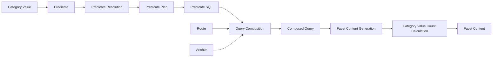
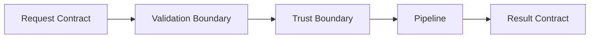
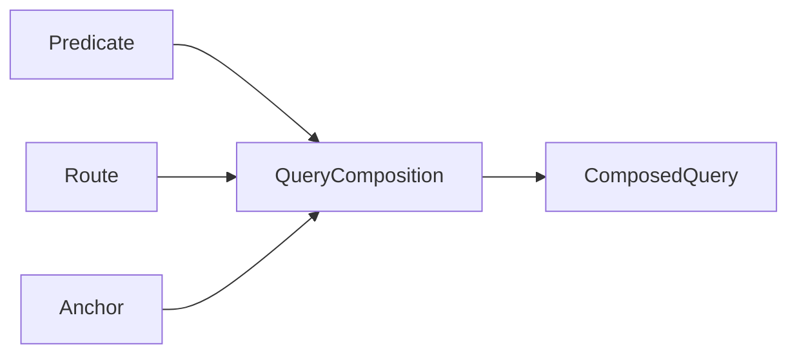
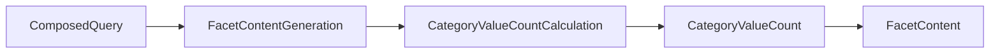

# Design

## Purpose

This document describes the architecture of the SEAD Query API, the core concepts that shape its behavior, and the responsibilities of the major runtime components.

The document focuses on the conceptual model, architectural structure, design decisions, and implementation responsibilities of the system.

This is an architecture document. It is not a developer setup guide, testing guide, deployment guide, or operational runbook.

The terminology used in this document is defined in `docs/GLOSSARY.md`, which is the authoritative source of system terminology.

---

## Design Status

### Current Runtime

The current authoritative runtime is the existing faceted query API implemented in the solution projects.

This runtime supports faceted browsing over the SEAD database and remains the production implementation for all supported query scenarios.

### Query-Engine Overhaul

A query-engine overhaul is currently in progress on branch `query-engine-overhaul`.

The overhaul introduces:

* Route-based query modeling
* Anchor-centered query composition
* Predicate planning and compilation
* Composed Query execution
* Facet-type-specific content generation strategies

The goal of the overhaul is to replace the existing join-template-driven query model with a more composable and maintainable architecture based on Routes, Anchors, Predicates, and Composed Queries.

### Current Overhaul Status

The overhaul is no longer purely conceptual.

The current branch runtime includes:

* a compiled and validated discrete vertical slice
* integration with `FacetContentService`
* route-based predicate resolution
* anchor-based query composition
* composed facet-content generation

The validated composed slice currently operates alongside the legacy runtime.

Requests that fall outside the validated composed contract continue to use the legacy execution path.

### Open Items

The following areas remain under active development:

* widening support across additional discrete targets
* widening support across range targets
* final route-definition format
* final migration and cutover strategy
* companion ADRs and subsystem documentation

---

## Conceptual Model

The architecture is centered on a small set of domain entities, domain processes, and architectural concepts.

### Domain Entities

The primary domain entities are:

* Facet
* Category
* Category Value
* Category Value Count
* Predicate
* Predicate Plan
* Predicate SQL
* Anchor
* Route
* Route Graph
* Composed Query
* Facet Content

These concepts describe the problem domain independently of implementation details.

### Domain Processes

The primary domain processes are:

* Route Resolution
* Predicate Resolution
* Query Composition
* Facet Content Generation
* Category Value Count Calculation

These processes transform domain entities into other domain entities.

### Architectural Concepts

The primary architectural concepts are:

* Request Contract
* Filter Contract
* Result Contract
* Validation Boundary
* Trust Boundary
* Pipeline
* Orchestrator
* DTO
* Producer
* Consumer

These concepts describe how the software is organized and how responsibilities are distributed.

---

## Conceptual Flow

At a conceptual level, the system transforms user selections into Facet Content through a series of domain processes.



The resulting Facet Content is represented by a Result Contract and returned to the caller.

---

## Architectural Flow

At runtime, the domain processes are implemented through a set of coordinated architectural components.



After a request crosses the Validation Boundary, downstream components may assume that required invariants have been satisfied.

The Pipeline then coordinates the domain processes required to transform the incoming Request Contract into a Result Contract.

---

## Central Design Principle

The central design principle of the query-engine overhaul is Anchor-based Query Composition.

All Predicates participating in a Composed Query must resolve to the same Anchor.

Query Composition combines compatible Predicates through this common Anchor contract to create a Composed Query.

Facet Content is then generated from the resulting Composed Query rather than from a large pre-assembled join structure.

This design separates:

* relationship traversal
* predicate evaluation
* query composition
* facet-content generation

The separation of these concerns is the primary mechanism used to improve maintainability, testability, and extensibility of the query engine.

## Domain Model

The SEAD Query API is built around a domain model that describes how users navigate, filter, and explore information within the SEAD database.

The model separates:

* Domain Entities — the things that exist within the query domain.
* Domain Processes — the activities that transform those entities.

The purpose of the query engine is to transform user selections into Facet Content through a sequence of well-defined domain processes.

---

### Facets, Categories, and Category Values

The user-facing navigation model begins with Facets.

A Facet is a user-facing filtering and navigation mechanism that represents a Category.

Examples include:

| Facet              | Category     |
| ------------------ | ------------ |
| Country Facet      | Country      |
| Taxon Facet        | Taxon        |
| Time Period Facet  | Time Period  |
| Feature Type Facet | Feature Type |

A Category defines a classification dimension.

Each Category contains one or more Category Values.

Examples:

| Category    | Category Values         |
| ----------- | ----------------------- |
| Country     | Sweden, Norway, Finland |
| Taxon       | Betula, Pinus, Quercus  |
| Time Period | Neolithic, Bronze Age   |

Category Values are the elements users browse and select when interacting with Facets.

---

### Target and Predicate Facets

A Facet may participate in a request in different roles.

#### Target Facet

The Target Facet is the Facet currently being populated.

Facet Content is generated for the Target Facet.

Examples:

```text
Country Facet
    ← Target Facet
```

```text
Taxon Facet
    ← Target Facet
```

#### Predicate Facet

A Predicate Facet contributes filtering logic to a request.

Selections made in Predicate Facets become Predicates that constrain the resulting Composed Query.

Examples:

```text
Country = Sweden
Taxon = Betula
```

#### Secondary Predicate Facet

A Secondary Predicate Facet contributes filtering logic but is not the Target Facet.

For example:

```text
Target Facet:
    Taxon

Secondary Predicate Facets:
    Country = Sweden
    Time Period = Neolithic
```

The same Facet may act as a Target Facet in one request and a Secondary Predicate Facet in another.

Roles are request-specific.

---

### Predicates

A Predicate is a filtering condition derived from a selected Category Value.

Examples:

```text
Country = Sweden
```

```text
Taxon = Betula
```

```text
Sample Date between 5000 BCE and 4000 BCE
```

Predicates express filtering intent.

They describe what should be filtered but not how that filtering will be performed.

Predicates are transformed into Predicate Plans and ultimately into Predicate SQL before execution.

---

### Anchors

An Anchor is the common entity to which all Predicates must resolve before they can participate in the same Composed Query.

Examples of Anchors include:

```text
Site
Sample
Taxon
```

The Anchor is one of the most important concepts in the system.

The query engine requires all active Predicates within a Composed Query to resolve to the same Anchor.

This rule is a fundamental domain invariant.

Without a common Anchor, query composition is not possible.

---

### Routes and Route Graphs

A Route describes how a Category connects to an Anchor.

Examples:

```text
Country → Site
```

```text
Taxon → Analysis Entity → Sample
```

A Route is a logical traversal.

It is not a SQL query.

The complete set of known Routes forms the Route Graph.

The Route Graph provides the structural knowledge required for Predicate Resolution and Query Composition.

---

### Composed Queries

A Composed Query represents the combined filtering state of a request.

It is created by combining multiple Predicates through a common Anchor.

For example:

```text
Country = Sweden
AND
Taxon = Betula
AND
Time Period = Neolithic
```

may become a Composed Query anchored on:

```text
Site
```

The Composed Query is the central domain entity of the query-engine overhaul.

It represents the complete filtering context used to generate Facet Content.

---

### Facet Content

Facet Content is the information generated for a Target Facet from a Composed Query.

Facet Content contains:

* Category Values
* Category Value Counts

Example:

| Category Value | Count |
| -------------- | ----- |
| Sweden         | 234   |
| Norway         | 118   |
| Finland        | 57    |

Facet Content is the primary domain result produced by the query engine.

---

## Domain Processes

Domain Processes transform domain entities into other domain entities.

The query engine is primarily a sequence of domain processes that convert user selections into Facet Content.

---

### Route Resolution

Route Resolution determines how a Predicate's Category connects to the Anchor required by a Composed Query.

Inputs:

* Predicate
* Category
* Anchor
* Route Graph

Output:

* Route

Route Resolution answers the question:

> How does this Predicate reach the required Anchor?

---

### Predicate Resolution

Predicate Resolution transforms a Predicate into a Predicate Plan.

Inputs:

* Predicate
* Route
* Anchor

Output:

* Predicate Plan

Predicate Resolution determines how a Predicate can be applied to the required Anchor.

The resulting Predicate Plan is independent of SQL and execution technology.

---

### Query Composition

Query Composition creates a Composed Query.

Inputs:

* Predicate
* Route
* Anchor

Output:

* Composed Query

Query Composition combines all compatible Predicates that have resolved to a common Anchor.

The result is a single query context representing the active filtering state.



---

### Facet Content Generation

Facet Content Generation produces Facet Content for a Target Facet.

Inputs:

* Composed Query
* Target Facet

Output:

* Facet Content

Facet Content Generation determines which Category Values belong in the Target Facet and prepares the information required for presentation.

Facet Content Generation includes Category Value Count Calculation as a sub-process.

---

### Category Value Count Calculation

Category Value Count Calculation determines the number of Anchors associated with each Category Value.

Inputs:

* Composed Query
* Target Facet
* Category Value

Outputs:

* Category Value Count

The resulting counts become part of the generated Facet Content.



---

## Domain Process Overview

The complete domain flow can be summarized as:

```mermaid
flowchart LR

    CategoryValue
        --> Predicate

    Predicate
        --> RouteResolution

    RouteResolution
        --> Route

    Route
        --> PredicateResolution

    PredicateResolution
        --> PredicatePlan

    PredicatePlan
        --> QueryComposition

    QueryComposition
        --> ComposedQuery

    ComposedQuery
        --> FacetContentGeneration

    FacetContentGeneration
        --> CategoryValueCountCalculation

    CategoryValueCountCalculation
        --> FacetContent
```



This conceptual model is independent of implementation details and provides the foundation for the runtime architecture described in the following sections.

## Runtime Architecture

The runtime architecture implements the domain model through a set of components with clearly separated responsibilities.

At a high level, the runtime:

1. Receives a client request.
2. Reconstructs the Request Contract.
3. Validates the request.
4. Resolves Facets, Predicates, Routes, and Anchors.
5. Creates or executes a Composed Query.
6. Generates Facet Content.
7. Returns a Result Contract.

The runtime should be understood as an implementation of the domain processes described earlier, not as a separate conceptual model.

---

## Main Runtime Components

The solution is organized around the following runtime responsibilities.

| Project               | Responsibility                                                                                |
| --------------------- | --------------------------------------------------------------------------------------------- |
| `sead.query.api`      | HTTP entry points, request handling, application startup, and API-level response formatting   |
| `sead.query.core`     | shared domain entities, query model, facet model, service contracts, and runtime abstractions |
| `sead.query.infra`    | infrastructure concerns, persisted configuration, repositories, and database-backed metadata  |
| `sead.query.composer` | route-based Predicate Resolution, Query Composition, and Composed Query execution             |
| `sead.query.test`     | unit, integration, and live tests for legacy and composed query behavior                      |

The key design problem is not HTTP transport. The key design problem is translating Facets, Category Values, Predicates, Routes, and Anchors into correct and composable database queries.

---

## Architectural Concepts Used at Runtime

The runtime is described using the following architectural concepts from `docs/GLOSSARY.md`.

| Concept             | Runtime Meaning                                                                        |
| ------------------- | -------------------------------------------------------------------------------------- |
| Request Contract    | The validated input required to construct or execute a Composed Query                  |
| Filter Contract     | The representation of a Composed Query after Predicate filtering has been resolved     |
| Result Contract     | The returned representation of generated Facet Content                                 |
| Validation Boundary | The point where incomplete or invalid requests are rejected                            |
| Trust Boundary      | The point after which downstream components assume the request is valid                |
| Pipeline            | The ordered runtime flow from Request Contract to Result Contract                      |
| Orchestrator        | A component that coordinates specialized components without owning their internal work |
| DTO                 | A data structure used to carry contract data across boundaries                         |
| Producer            | A component that creates information for downstream use                                |
| Consumer            | A component that receives and uses information created upstream                        |

---

## Request Contract Construction

Request Contract construction converts incoming API state into a stable runtime input.

This includes:

* reconstituting facet configuration
* resolving the Target Facet
* identifying active Predicate Facets
* normalizing selected Category Values
* removing invalid or stale selections
* preparing the input needed for Predicate Resolution and Query Composition

The Request Contract is the architectural representation of the request that will be used to construct or execute a Composed Query.

### Main Components

| Component                            | Responsibility                                                        |
| ------------------------------------ | --------------------------------------------------------------------- |
| `FacetsController.Load`              | HTTP entry point for facet loading                                    |
| `FacetConfigReconstituteService`     | rebuilds facet configuration from request state                       |
| `LoadFacetService`                   | normalizes picks and prepares the load request                        |
| `ComposedFacetContentRequestFactory` | creates the composed Request Contract for supported composed requests |

---

## Validation Boundary

The Validation Boundary protects the composed pipeline from invalid requests.

Before a request crosses this boundary, the system must verify that the request satisfies required invariants.

Examples include:

* a Target Facet is present
* selected Category Values are valid
* Predicate Facets can be resolved
* required Routes exist
* all active Predicates can resolve to the same Anchor
* unsupported composed requests are detected before composed execution begins

After the request crosses the Validation Boundary, downstream components operate inside the Trust Boundary.

---

## Trust Boundary

The Trust Boundary begins after validation.

Inside the Trust Boundary, components may assume:

* the Request Contract is complete
* the Target Facet is known
* active Predicate Facets are valid
* required Routes have been resolved or are resolvable
* the Anchor is compatible with the Composed Query
* unsupported requests have already been rejected or routed to legacy fallback

This avoids repeated defensive checks in lower-level components and keeps validation responsibility centralized.

---

## Composed Query Orchestration

The composed query path is coordinated by an Orchestrator.

The Orchestrator does not own all detailed behavior itself. Instead, it delegates to specialized Producers and Consumers.

In the current overhaul, `ComposedFacetContentService` acts as the main orchestrator for composed facet-content loading.

Its responsibilities are to:

* decide whether a request can use the composed path
* coordinate Request Contract creation
* coordinate Filter Contract creation
* select the correct Target Facet handler
* delegate Facet Content Generation
* return the Result Contract

It should not own all target-facet-specific behavior directly.

---

## Predicate and Route Responsibilities

Predicate and Route responsibilities are separated so that relationship traversal does not become duplicated across SQL templates.

### Route Resolution

Route Resolution determines how a Predicate's Category connects to the required Anchor.

Runtime responsibilities include:

* parsing route expressions
* resolving route fragments
* validating route table chains
* selecting valid Routes from the Route Graph
* preparing route information for Predicate Resolution and SQL generation

### Predicate Resolution

Predicate Resolution transforms a Predicate into a Predicate Plan.

Runtime responsibilities include:

* interpreting selected Category Values
* applying facet-type-specific predicate rules
* resolving the Predicate to the required Anchor
* creating a Predicate Plan
* rejecting unsupported or invalid predicate configurations

### Predicate SQL Generation

Predicate SQL Generation compiles Predicate Plans into executable SQL fragments.

Runtime responsibilities include:

* producing anchor-key-returning SQL
* preserving anchor aliases
* enforcing valid predicate operators
* generating SQL compatible with Query Composition

---

## Filter Contract Construction

The Filter Contract represents the filtering state of a Composed Query after active Predicates have been resolved and combined.

In the composed runtime path, `ComposedFacetContentFilterQueryFactory` owns construction of the composed anchor filter.

Its responsibilities include:

* consuming validated Predicate Plans
* compiling or receiving Predicate SQL
* combining compatible predicate filters
* preserving the active Anchor key
* handling zero-filter and single-filter cases explicitly
* rejecting incompatible-anchor cases

The Filter Contract should represent the Composed Query filtering context, not the final Facet Content itself.

---

## Facet Content Generation

Facet Content Generation produces Facet Content for the Target Facet from the Composed Query.

This stage is target-facet-specific because different facet types have different behavior.

Examples include:

* discrete facets
* range facets
* intersect facets
* geo-polygon facets

The composed runtime therefore delegates target-specific behavior to handler implementations.

### Main Components

| Component                               | Responsibility                                          |
| --------------------------------------- | ------------------------------------------------------- |
| `IComposedFacetContentHandler`          | target-facet-specific Facet Content Generation boundary |
| `DiscreteComposedFacetContentHandler`   | discrete target Facet Content Generation                |
| `RangeComposedFacetContentHandler`      | range target Facet Content Generation                   |
| `IntersectComposedFacetContentHandler`  | intersect target Facet Content Generation               |
| `GeoPolygonComposedFacetContentHandler` | geo-polygon target Facet Content Generation             |

Handlers own:

* category information lookup
* Category Value discovery
* Category Value Count Calculation
* result row mapping
* distribution construction
* target-type-specific post-processing

---

## Result Contract Assembly

The Result Contract is the architectural representation of generated Facet Content returned to the caller.

It should expose the result of Facet Content Generation without leaking unnecessary implementation details from:

* Predicate Resolution
* Route Resolution
* Predicate SQL Generation
* Query Composition
* handler-specific internals

The Result Contract may be implemented by DTOs such as `FacetContent` or `ResultContentSet`.

---

## Legacy and Composed Runtime Boundary

The legacy runtime remains authoritative for requests outside the validated composed contract.

The composed path is used only when the request can be handled safely by the composed query architecture.

The boundary is explicit:

* `FacetContentService.Load` is the runtime entry point.
* `ComposedFacetContentService.CanHandle(...)` determines whether the composed path applies.
* Unsupported requests fall back to the legacy category-count path.
* Direct unsupported calls to the composed service should fail with actionable errors.

This preserves existing API behavior while allowing the composed architecture to widen incrementally.

---

## Component Responsibility Summary

| Responsibility                                       | Primary Component                              |
| ---------------------------------------------------- | ---------------------------------------------- |
| HTTP entry point                                     | `FacetsController.Load`                        |
| Facet configuration reconstruction                   | `FacetConfigReconstituteService`               |
| Pick normalization                                   | `LoadFacetService`                             |
| Runtime handoff between legacy and composed behavior | `FacetContentService.Load`                     |
| Composed Query orchestration                         | `ComposedFacetContentService`                  |
| Request Contract construction                        | `ComposedFacetContentRequestFactory`           |
| Filter Contract construction                         | `ComposedFacetContentFilterQueryFactory`       |
| Route parsing and resolution                         | route parser, Route Graph, route resolver      |
| Predicate Resolution                                 | facet predicate resolvers                      |
| Predicate SQL generation                             | route and predicate SQL compilers              |
| Facet Content Generation                             | `IComposedFacetContentHandler` implementations |
| Category Value Count Calculation                     | target-facet-specific content handlers         |
| Result Contract assembly                             | facet-content services and handlers            |

---

## Runtime Architecture Diagram

```mermaid
flowchart LR

    FacetsController[FacetsController.Load]
        --> Reconstitution[FacetConfigReconstituteService]

    Reconstitution
        --> LoadFacetService[LoadFacetService]

    LoadFacetService
        --> FacetContentService[FacetContentService.Load]

    FacetContentService
        --> CanHandle{Can handle composed?}

    CanHandle
        -->|No| LegacyPath[Legacy Facet Content Path]

    CanHandle
        -->|Yes| ComposedService[ComposedFacetContentService]

    ComposedService
        --> RequestFactory[ComposedFacetContentRequestFactory]

    RequestFactory
        --> FilterFactory[ComposedFacetContentFilterQueryFactory]

    FilterFactory
        --> Handler[IComposedFacetContentHandler]

    Handler
        --> ResultContract[Result Contract]
```



This diagram shows implementation responsibilities. The glossary defines the concepts that these components implement.
