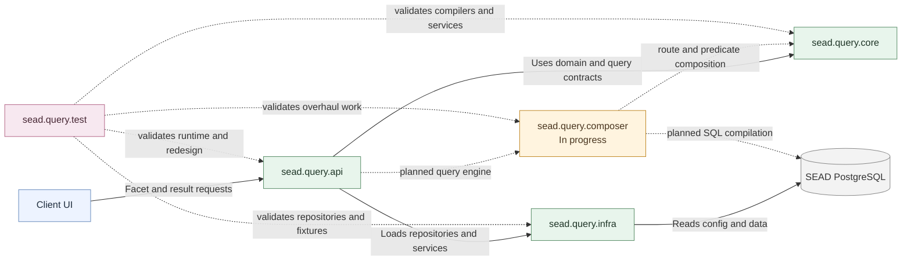
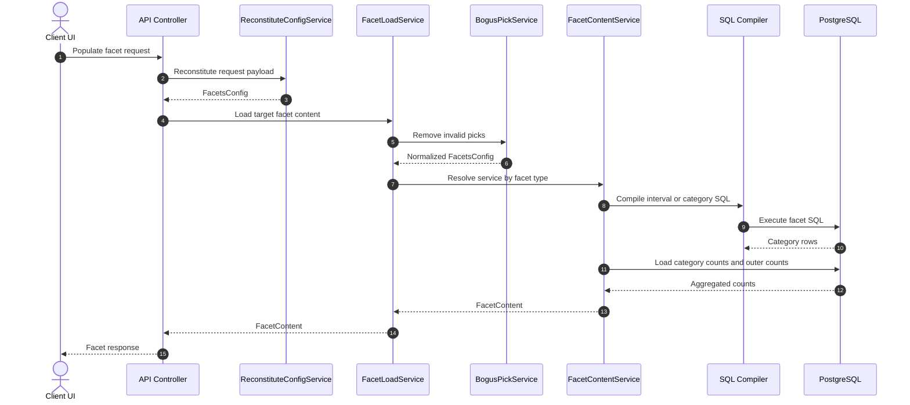
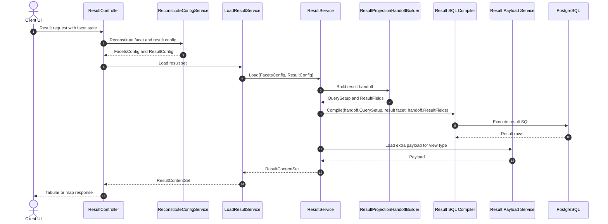
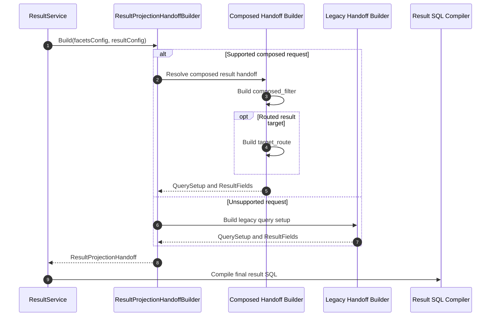
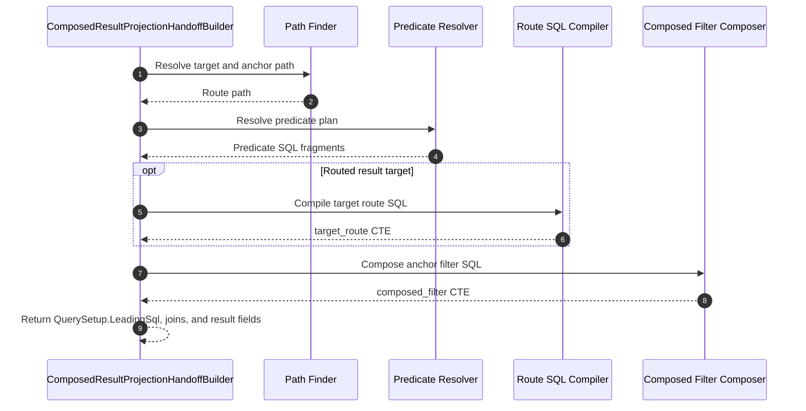
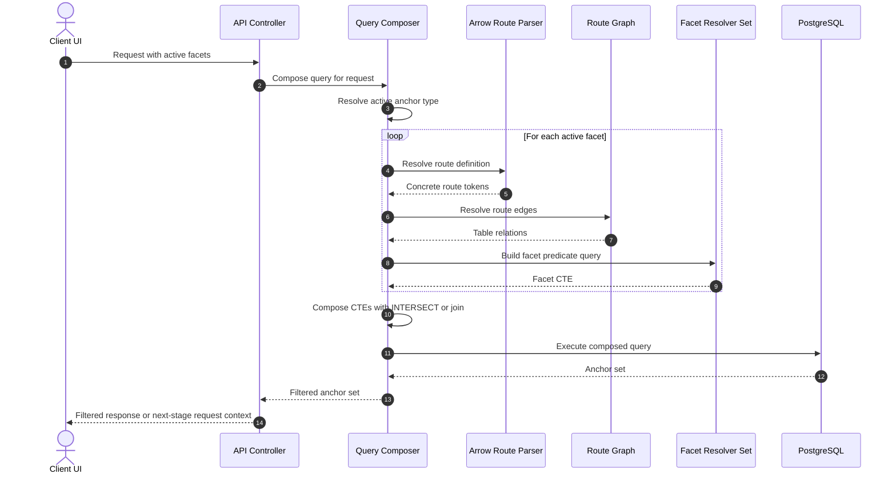
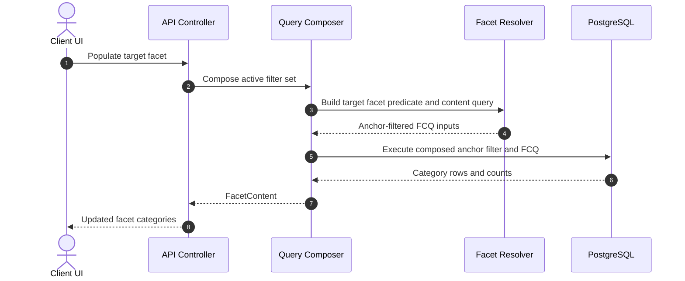

```mermaid
flowchart LR
    Request[Facet request]
    Composer[Query Composer]
    Parser[Arrow Route Parser]
    Graph[Route Graph]
    Resolvers[Facet Predicate Resolvers]
    Ctes[Facet CTEs]
    Compose[INTERSECT or join composition]
    Projection[Facet content or result projection]
    Db[(SEAD PostgreSQL)]
    Response[Response payload]

    Request --> Composer
    Composer --> Parser
    Parser --> Graph
    Composer --> Resolvers
    Graph --> Resolvers
    Resolvers --> Ctes
    Ctes --> Compose
    Compose --> Projection
    Projection --> Db
    Db --> Response

    classDef input fill:#edf3ff,stroke:#6c8ebf,color:#1f2d3d;
    classDef composer fill:#fff4df,stroke:#c28b2c,color:#4a3620;
    classDef compose fill:#e8f5ec,stroke:#5b8f6a,color:#1f3527;
    classDef store fill:#f3f3f3,stroke:#8a8a8a,color:#333333;
    classDef output fill:#f7e8f0,stroke:#b56a8a,color:#472734;

    class Request input;
    class Composer,Parser,Graph,Resolvers composer;
    class Ctes,Compose,Projection compose;
    class Db store;
    class Response output;
```

# Architecture Diagrams

This document provides visual diagrams for the SEAD Query API.

Use `docs/DESIGN.md` as the primary written architecture reference. These diagrams summarize the current runtime, the core request workflows, and the planned query-engine overhaul.

## Diagram Status

- Current runtime diagrams reflect the existing faceted query API flow.
- Overhaul diagrams describe the active route-based, anchor-centered work on `query-engine-overhaul`, including the current result-projection handoff boundary.
- Detailed deployment and operations diagrams are `TBD`.

## System Overview

## Current Runtime Responsibilities

```mermaid
flowchart LR
    Request[Facet request]
    Reconstitute[Reconstitute config]
    Clean[Remove bogus picks]
    Resolve[Resolve target facet]
    Select[Select facet content service]
    Compile[Compile interval or category SQL]
    Count[Load category counts]
    Assemble[Assemble facet content]
    Response[Facet response]
    Db[(SEAD PostgreSQL)]

    Request --> Reconstitute --> Clean --> Resolve --> Select --> Compile
    Compile --> Db
    Db --> Count --> Assemble --> Response

    classDef input fill:#edf3ff,stroke:#6c8ebf,color:#1f2d3d;
    classDef process fill:#e8f5ec,stroke:#5b8f6a,color:#1f3527;
    classDef store fill:#f3f3f3,stroke:#8a8a8a,color:#333333;
    classDef output fill:#fff4df,stroke:#c28b2c,color:#4a3620;

    class Request input;
    class Reconstitute,Clean,Resolve,Select,Compile,Count,Assemble process;
    class Db store;
    class Response output;
```

## Current Facet Content Sequence

## Current Result Generation Sequence

## Current Result Handoff Boundary

## Current Composed Result Handoff Internals

## Planned Overhaul Component Model

## Planned Anchor-Based Query Composition Sequence

## Planned Facet Content Flow In The Overhaul

## Reading Guide

- Use the current-runtime diagrams when reasoning about today’s API behavior.
- Use the overhaul diagrams when discussing the target query model on `query-engine-overhaul`.
- When the two disagree, `docs/DESIGN.md` should state which behavior is current and which is planned.