# Architecture Diagrams

This document provides visual diagrams for the SEAD Query API.

Use `docs/DESIGN.md` as the primary written architecture reference. These diagrams summarize the current runtime, the core application flows, the active composer-based query baseline, and the explicit compatibility boundaries that still remain.

## Diagram Status

- Current runtime diagrams reflect the current application baseline, including the composer-owned query path used for the validated composed surface.
- Compatibility diagrams show where legacy fallback still exists for unsupported request families.
- Detailed deployment and operations diagrams are `TBD`.

## System Overview

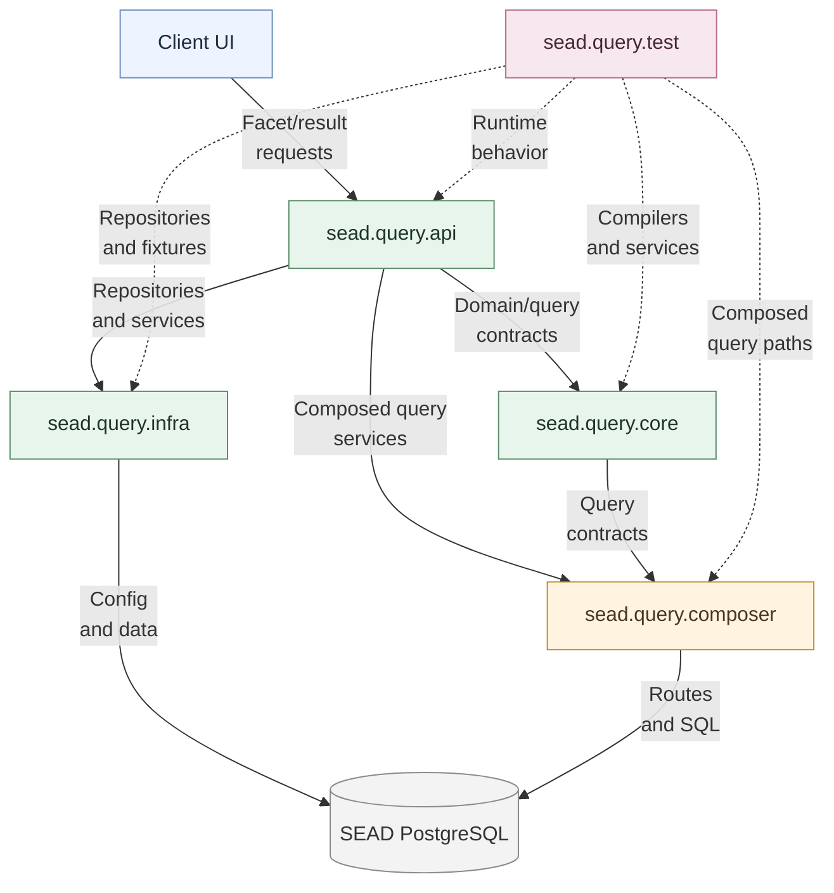

## Current Request Surface Summary

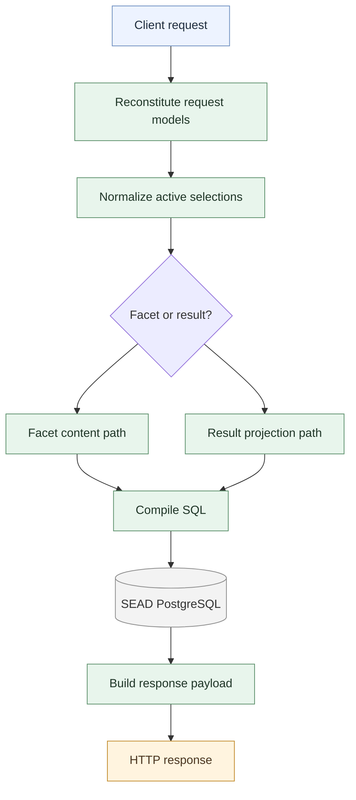

## Application Startup And Runtime Composition

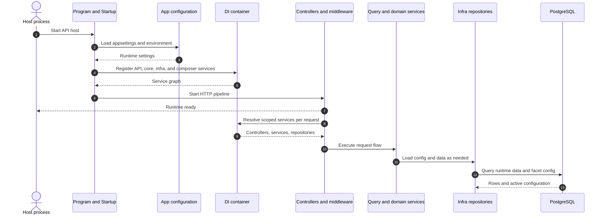

## Configuration Authoring, Import, And Runtime Use

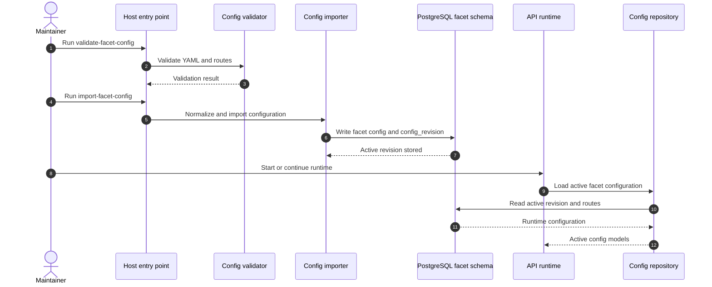

## Current Facet Content Sequence

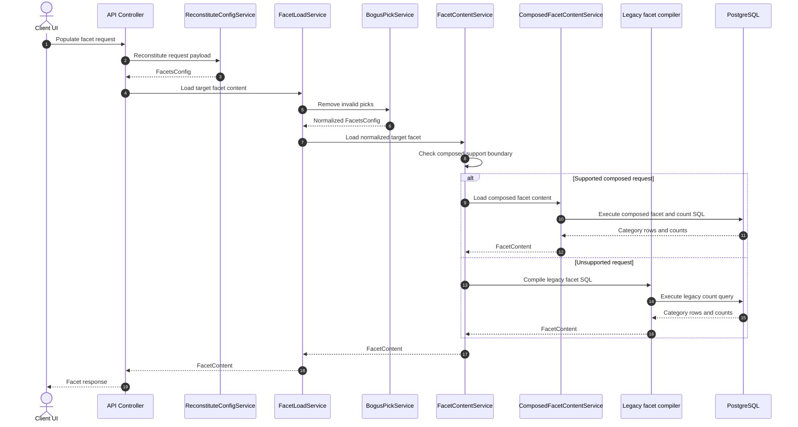

## Current Facet Capability Boundary

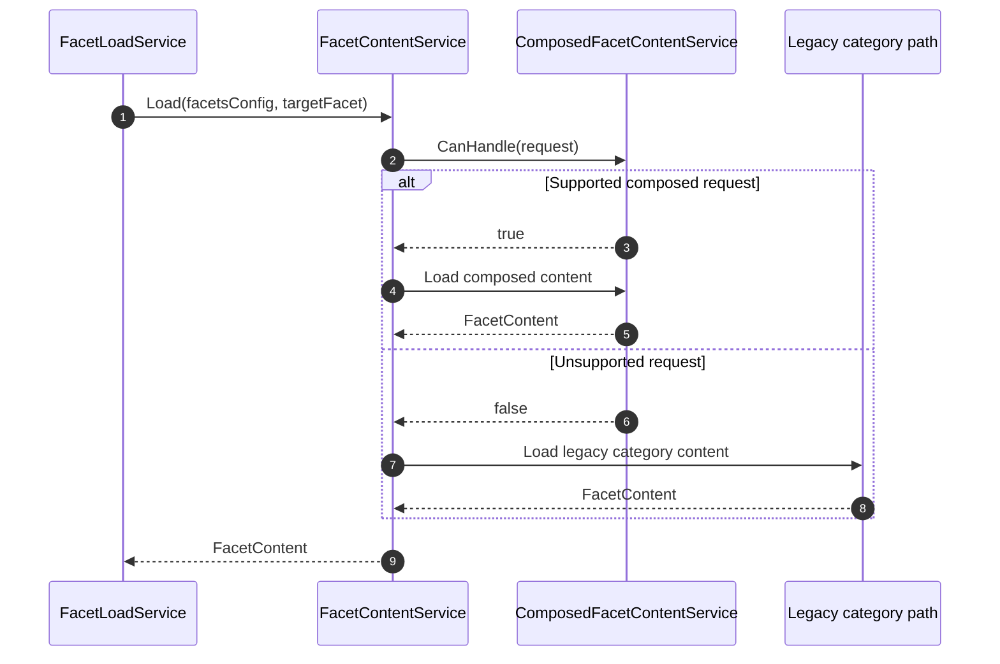

## Current Result Generation Sequence

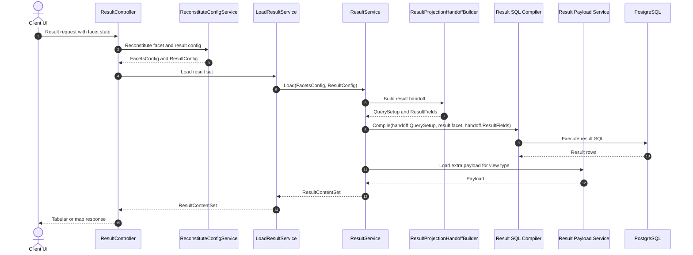

## Current Result Handoff Boundary

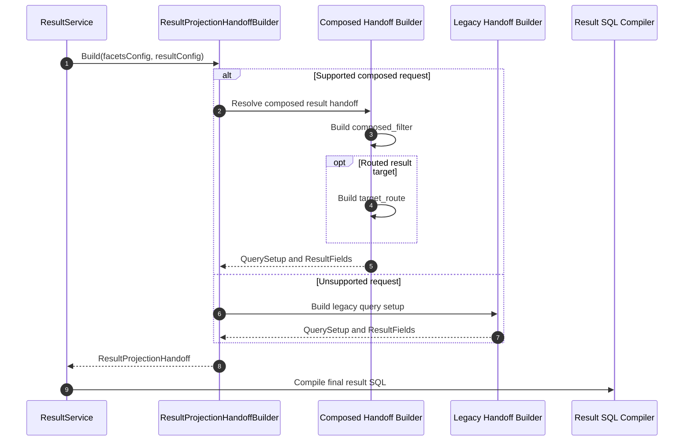

## Current Composed Result Handoff Internals

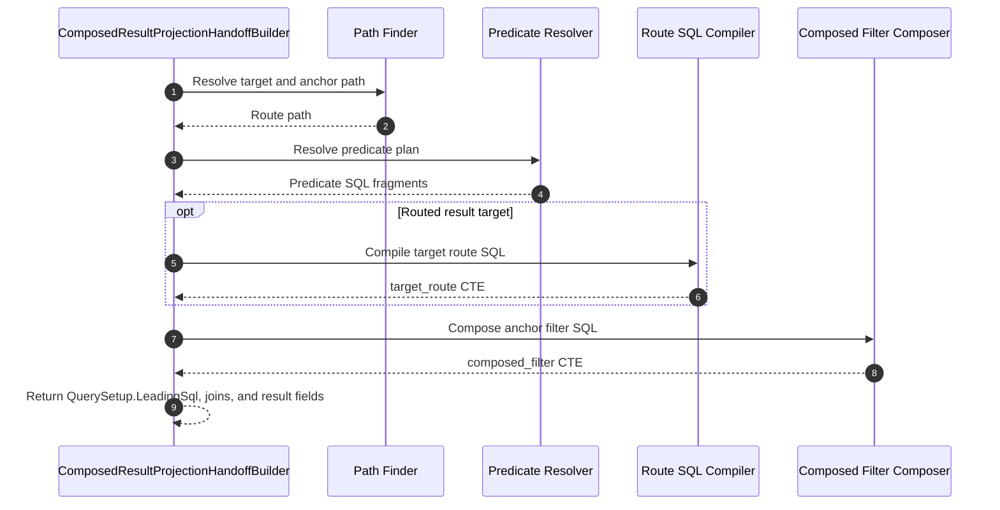

## Current Composer Component Model

```mermaid
flowchart LR
    Request[Facet request]
    Composer[Query Composer]
    Parser[Arrow Route Parser]
    Graph[Route Graph]
    Resolvers[Facet Predicate Resolvers]
    Ctes[Facet CTEs]
    Compose[INTERSECT or join composition]
    Projection[Facet content or result projection]
    Db[(SEAD PostgreSQL)]
    Response[Response payload]

    Request --> Composer
    Composer --> Parser
    Parser --> Graph
    Composer --> Resolvers
    Graph --> Resolvers
    Resolvers --> Ctes
    Ctes --> Compose
    Compose --> Projection
    Projection --> Db
    Db --> Response

    classDef input fill:#edf3ff,stroke:#6c8ebf,color:#1f2d3d;
    classDef composer fill:#fff4df,stroke:#c28b2c,color:#4a3620;
    classDef compose fill:#e8f5ec,stroke:#5b8f6a,color:#1f3527;
    classDef store fill:#f3f3f3,stroke:#8a8a8a,color:#333333;
    classDef output fill:#f7e8f0,stroke:#b56a8a,color:#472734;

    class Request input;
    class Composer,Parser,Graph,Resolvers composer;
    class Ctes,Compose,Projection compose;
    class Db store;
    class Response output;
```

## Current Composed Query Sequence

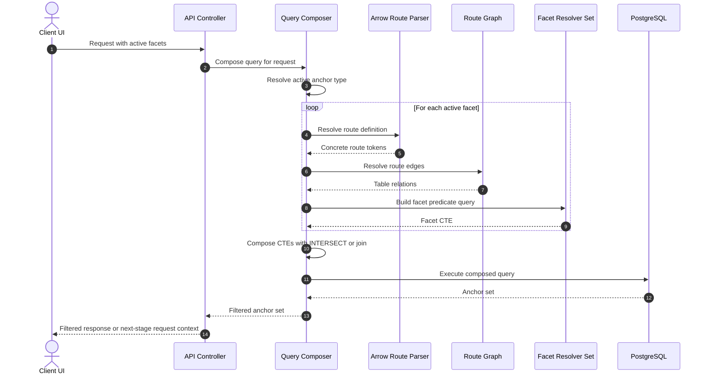

## Current Composed Facet Content Sequence

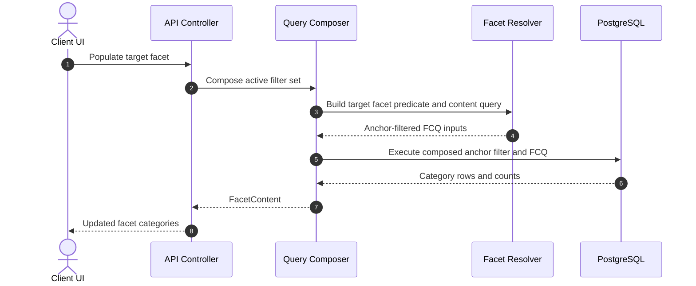

## Reading Guide

- Use the system and startup diagrams when discussing the application as a whole.
- Use the facet and result sequences when tracing request execution and compatibility boundaries.
- Use the composer diagrams when reasoning about the current composed query baseline.
- When a diagram and prose differ, `docs/DESIGN.md` is the primary written source of truth.