# Glossary

This glossary defines the canonical terminology for the SEAD Query API.

Concepts are classified as either:

- **Domain Concepts** — concepts from the problem domain, independent of implementation.
- **Architectural Concepts** — concepts describing software organization, responsibilities, interactions, and implementation patterns.

## Index 

### Part A — Domain Concepts

[Facet](#concept-facet)
[Target Facet](#concept-target-facet)
[Predicate Facet](#concept-predicate-facet)

[Category](#concept-category)
[Category Value](#concept-category-value)
[Category Value Count](#concept-category-value-count)

[Predicate](#concept-predicate)
[Predicate Plan](#concept-predicate-plan)
[Predicate SQL](#concept-predicate-sql)

[Anchor](#concept-anchor)

[Route](#concept-route)
[Route Graph](#concept-route-graph)

[Composed Query](#concept-composed-query)

[Facet Content](#concept-facet-content)

### Part B — Design Processes (activities)

[Query Composition](#process-query-composition)
[Predicate Resolution](#process-predicate-resolution)
[Route Resolution](#process-route-resolution)
[Category Value Count Calculation](#process-category-value-count-calculation)
[Facet Content Generation](#process-facet-content-generation)

### Part C — Architectural Concepts

[Contract](#concept-contract)
[Request Contract](#concept-request-contract)
[Filter Contract](#concept-filter-contract)
[Result Contract](#concept-result-contract)

[Boundary](#concept-boundary)
[Validation Boundary](#concept-validation-boundary)
[Trust Boundary](#concept-trust-boundary)

[Handoff](#concept-handoff)

[Producer](#concept-producer)
[Consumer](#concept-consumer)

[Pipeline](#concept-pipeline)
[Orchestrator](#concept-orchestrator)

[DTO](#concept-dto)

[Intermediate Representation (IR)](#concept-intermediate-representation-ir)

[Ownership](#concept-ownership)
[Invariant](#concept-invariant)

[Delegation](#concept-delegation)

## Terminology Rules

- Define each concept once.
- Use canonical names.
- Prefer references to existing concepts over repeating definitions.
- Relationships should reference other glossary concepts whenever possible.
- Implementation classes, DTOs, tables, services, and APIs are examples, not concepts.
- Domain concepts describe the problem domain.
- Architectural concepts describe software organization and responsibilities.
- Mermaid diagrams must not introduce undefined concepts.

---

## Concept Map

### Query Composition

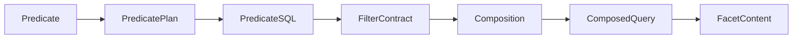

### Processing Pipeline

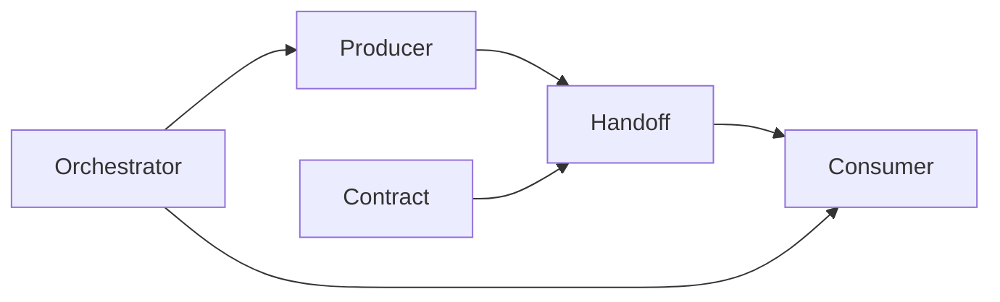

---


# Part A — Domain Concepts

## Concept: Facet

### Type

Domain Concept

### Definition

A user-facing filtering and navigation mechanism for a Category.

### Description

A Facet is a user-facing representation of a Category by presenting its Category Values and associated Category Value Counts.

Facets allow users to browse, select, and combine filters when constructing a Composed Query.

For example:

| Facet             | Category    |
|-------------------|-------------|
| Country Facet     | Country     |
| Taxon Facet       | Taxon       |
| Time Period Facet | Time Period |

### Relationships

| Relationship   | Concept              |
|----------------|----------------------|
| represents     | Category             |
| displays       | Category Value       |
| displays       | Category Value Count |
| specialized by | Target Facet         |
| specialized by | Predicate Facet      |

### Notes

A Facet is the user-facing representation of a Category.

The same Category may be represented differently by different Facets.

```text
Facet                = UI/navigation concept
Category             = classification concept
Category Value       = member of the classification
Category Value Count = anchor count for a member
```

## Concept: Target Facet

### Type

Domain Concept

### Definition

The Facet whose Facet Content is currently being generated.

### Description

While loading categories for the Country facet, Country is the target facet. The target facet determines which resolution strategy and handler are used.

### Relationships

| Relationship    | Concept          |
|-----------------|------------------|
| participates in | Request Contract |
| processed by    | Pipeline         |
| selected from   | Facet            |

---

## Concept: Predicate Facet

### Type

Domain Concept

### Definition

A facet that actively contributes filtering logic by narrowing the result set.

### Description

When a user selects Country = Sweden while browsing the Taxon facet, Country acts as a predicate facet.

### Relationships

| Relationship     | Concept         |
|------------------|-----------------|
| transformed into | Predicate Plan  |
| contributes to   | Filter Contract |
| specializes      | Facet           |

---

## Concept: Category

### Type

Domain Concept

### Definition

A classification dimension represented by a Facet and populated by Category Values.

### Description

A Category defines the type of information that a Facet exposes.

Examples include Country, Taxon, Feature Type, and Time Period.

A Category provides the semantic meaning of a Facet, while Category Values represent the individual members of that Category.

### Relationships

| Relationship   | Concept        |
|----------------|----------------|
| represented by | Facet          |
| contains       | Category Value |

### Examples

| Category     |
|--------------|
| Country      |
| Taxon        |
| Time Period  |
| Feature Type |

### Notes

A Category describes what is being classified, not the individual values being classified.

---

## Concept: Category Value

### Type

Domain Concept

### Definition

A member of a Category that may be displayed, selected, filtered, or counted.

### Description

A Category Value represents a specific value within a Category.

For example:

| Category | Category Value |
|----------|----------------|
| Country  | Sweden         |
| Country  | Norway         |
| Country  | Finland        |
| Taxon    | Betula         |
| Taxon    | Pinus          |

Category Values are the items users see and interact with when browsing a Facet.

### Relationships

| Relationship    | Concept              |
|-----------------|----------------------|
| belongs to      | Category             |
| associated with | Category Value Count |
| appears in      | Facet Content        |

### Examples

| Category    | Values                  |
|-------------|-------------------------|
| Country     | Sweden, Norway, Finland |
| Taxon       | Betula, Pinus, Quercus  |
| Time Period | Neolithic, Bronze Age   |

### Notes

A Category Value is a domain concept, not a database record.

The same Category Value may appear in many different Composed Queries.

---

## Concept: Category Value Count

### Type

Domain Concept

### Definition

The number of Anchors associated with a Category Value within a Composed Query.

### Description

A Category Value Count represents the size of the collection of resolved Anchors associated with a Category Value after all active predicates have been applied.

For example:

| Category Value | Count |
|----------------|-------|
| Sweden         | 234   |
| Norway         | 118   |
| Finland        | 57    |

When browsing the Country Facet, these counts indicate how many Anchors are associated with each Country value in the current Composed Query.

### Relationships

| Relationship    | Concept        |
|-----------------|----------------|
| associated with | Category Value |
| calculated from | Composed Query |
| based on        | Anchor         |
| appears in      | Facet Content  |

### Examples

Given:

- Target Facet = Country
- Predicate Facet = Time Period = Neolithic

Result:

| Category Value | Count |
|----------------|-------|
| Sweden         | 234   |
| Norway         | 118   |
| Finland        | 57    |

### Notes

A Category Value Count is query-dependent.

The same Category Value may have different counts in different Composed Queries because the active predicates and resulting collection of resolved Anchors may differ.

A Category Value Count represents the number of unique matching Anchors, not the number of database rows.

---


## Concept: Predicate

### Type

Domain Concept

### Definition

A filtering condition that constrains the collection of resolved Anchors of a Composed Query.

### Description

A Predicate expresses filtering intent derived from one or more user-supplied filter conditions.

Predicates are created from active Predicate Facets and represent the conditions that must be satisfied for an Anchor to be included in a Composed Query.

Before execution, a Predicate is transformed into a Predicate Plan, which is subsequently compiled into Predicate SQL.

Examples include:

- Country = Sweden
- Taxon = Betula
- Time Period = Neolithic
- Sample Date between 5000 BCE and 4000 BCE

A Predicate describes *what* should be filtered, not *how* the filtering is performed.

### Relationships

| Relationship     | Concept         |
|------------------|-----------------|
| derived from     | Category Value  |
| contributed by   | Predicate Facet |
| transformed into | Predicate Plan  |
| constrains       | Anchor          |
| participates in  | Composed Query  |

### Diagram

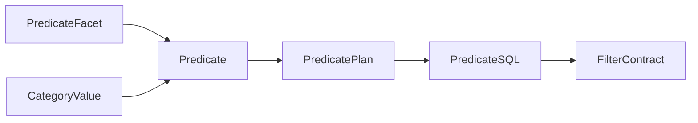

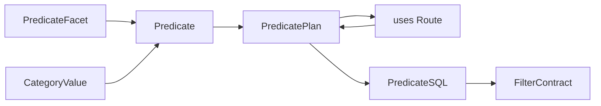

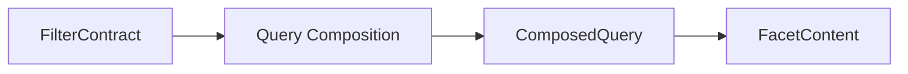

### Examples

| Predicate Facet | Category Value | Predicate                                 |
|-----------------|----------------|-------------------------------------------|
| Country         | Sweden         | Country = Sweden                          |
| Taxon           | Betula         | Taxon = Betula                            |
| Time Period     | Neolithic      | Time Period = Neolithic                   |
| Sample Date     | 5000–4000 BCE  | Sample Date BETWEEN 5000 BCE AND 4000 BCE |

### Notes

A Predicate is a logical condition, not a SQL expression.

Multiple Predicates may participate in the same Composed Query.

Predicates become composable only after they have been resolved to a common Anchor.

---

## Concept: Predicate Plan

### Type

Domain Concept

### Definition

An intermediate, technology-independent representation of a predicate.

### Description

A Predicate Plan describes filtering intent before it is translated into executable SQL.

### Relationships

| Relationship  | Concept                          |
|---------------|----------------------------------|
| uses          | Route                            |
| compiled into | Predicate SQL                    |
| is a          | Intermediate Representation (IR) |
| produced from | Predicate                        |

---

## Concept: Predicate SQL

### Type

Domain Concept

### Definition

The executable SQL representation of a predicate.

### Description

Predicate SQL is the database-specific form of a predicate used during query execution.

### Relationships

| Relationship   | Concept         |
|----------------|-----------------|
| produced from  | Predicate Plan  |
| contributes to | Filter Contract |

### Diagram

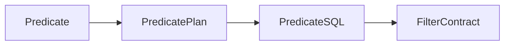

---

## Concept: Anchor

### Type

Domain Concept

### Definition

The common counting and composition entity to which all predicates must resolve.

### Description

The Anchor acts as the convergence point for all filter paths. Predicate results cannot be composed until they have been resolved to a common anchor.

### Relationships

| Relationship   | Concept           |
|----------------|-------------------|
| required by    | Query Composition |
| constrained by | Invariant         |
| referenced by  | Filter Contract   |

### Diagram

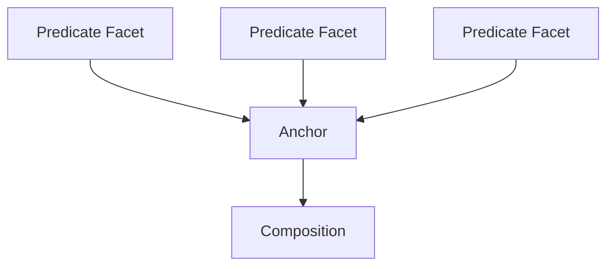

### Implementation Examples

- site
- sample
- taxon

---

## Concept: Route

### Type

Domain Concept

### Definition

A navigable (logical) path that connects a Category to an Anchor through one or more entity relationships.

### Description

A Route describes how a Predicate associated with a Category Value can be translated into a constraint on an Anchor.

Routes are used during predicate planning and query composition. They provide the structural information needed to transform filtering intent into executable queries.

For example, a Country predicate may resolve to a Site Anchor through a route that traverses site metadata relationships.

### Relationships

| Relationship  | Concept        |
|---------------|----------------|
| connects      | Category       |
| connects      | Anchor         |
| used by       | Predicate Plan |
| discovered in | Route Graph    |

### Examples

| Category     | Anchor | Route                            |
|--------------|--------|----------------------------------|
| Country      | Site   | Country → Site                   |
| Taxon        | Sample | Taxon → Analysis Entity → Sample |
| Feature Type | Site   | Feature Type → Feature → Site    |

### Notes

A Route describes a logical traversal, not a specific physical (SQL) join path.

Multiple Routes may exist between the same Category and Anchor.

---

## Concept: Route Graph

### Type

Domain Concept

### Definition

The complete set of known Routes between Categories, entities, and Anchors.

### Description

A Route Graph is a navigable model of the relationships that can be used to reach Anchors from Categories.

It provides the knowledge required for route discovery, predicate planning, and query composition.

When a Predicate must be resolved to an Anchor, the Route Graph is consulted to determine how that traversal can be performed.

### Relationships

| Relationship | Concept           |
|--------------|-------------------|
| contains     | Route             |
| supports     | Predicate Plan    |
| supports     | Query Composition |
| supports     | Composed Query    |

### Diagram

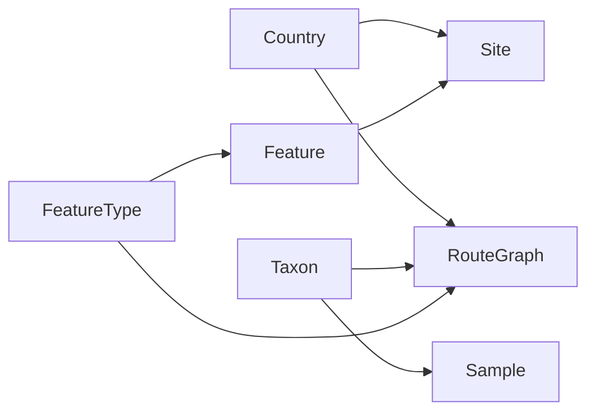

### Examples

A Route Graph may contain:

- Country → Site
- Taxon → Analysis Entity → Sample
- Sample Method → Sample
- Feature Type → Feature → Site

### Notes

The Route Graph is a conceptual model, not necessarily a runtime data structure.

Different implementations may represent the Route Graph as configuration, metadata, code, database records, or a combination of these.

The Route Graph defines what traversals are possible, not preferred traversals; individual Routes describe a specific traversal.

---

## Concept: Composed Query

### Type

Domain Concept

### Definition

A query context created by combining multiple predicate facets through a common anchor before facet content is generated.

### Description

A Composed Query represents the combined filtering state of a request. All active predicate facets are resolved to a common anchor and merged into a single query context. Facet content is generated from this composed state rather than from individual predicates.

### Relationships

| Relationship     | Concept           |
|------------------|-------------------|
| combines         | Predicate Facet   |
| requires         | Anchor            |
| produces         | Filter Contract   |
| used by          | Query Composition |
| represented by   | Request Contract  |
| resolved through | Route Graph       |

### Diagram

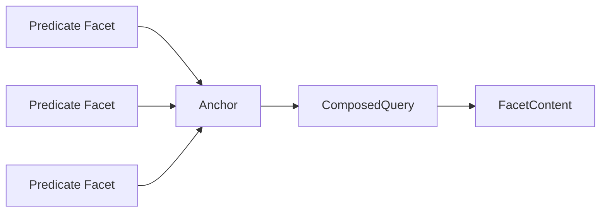

### Notes (mental model)

Predicate
    ↓
Predicate Plan
    ↓ uses
   Route
    ↓ discovered in
Route Graph
    ↓ resolves to
  Anchor
    ↓
Query Composition
    ↓
Composed Query

---


## Concept: Facet Content

### Type

Domain Concept

### Definition

The information generated for a Target Facet from a Composed Query.

### Description

Facet Content represents the result of evaluating a Composed Query for a specific Target Facet.

It contains the Category Values and associated Category Value Counts that are presented to users when browsing a Facet.

Facet Content answers the question:

> "Given the current Composed Query, what values are available in the Target Facet and how many Anchors are associated with each value?"

Facet Content is generated after all active Predicate Facets have been resolved, composed, and applied.

### Relationships

| Relationship   | Concept              |
|----------------|----------------------|
| generated from | Composed Query       |
| produced by    | Query Composition    |
| belongs to     | Target Facet         |
| contains       | Category Value       |
| contains       | Category Value Count |
| represented by | Result Contract      |

### Diagram

```mermaid
flowchart LR

    PredicateFacets[Predicate Facets]
        --> ComposedQuery

    Anchor
        --> ComposedQuery

    ComposedQuery
        --> Query Composition

    Query Composition
        --> FacetContent

    FacetContent
        --> CategoryValue

    CategoryValue
        --> CategoryValueCount
```

### Examples

Given:

- Target Facet = Country
- Predicate Facets:
  - Time Period = Neolithic
  - Taxon = Betula

Facet Content may contain:

| Category Value | Category Value Count |
|----------------|----------------------|
| Sweden         | 234                  |
| Norway         | 118                  |
| Finland        | 57                   |

Given:

- Target Facet = Taxon
- Predicate Facets:
  - Country = Sweden

Facet Content may contain:

| Category Value | Category Value Count |
|----------------|----------------------|
| Betula         | 341                  |
| Pinus          | 187                  |
| Quercus        | 92                   |

### Notes

Facet Content is query-dependent.

The same Target Facet may produce different Facet Content for different Composed Queries.

Facet Content is a domain concept and should not be confused with:

- API response models
- DTOs
- SQL result sets
- UI components

These may represent Facet Content, but they are not Facet Content itself.

---

# Part B - Domain Processes (activities)

## Process: Query Composition

### Definition

The process of resolving active Predicates to a common Anchor and combining them into a Composed Query.

### Inputs

- Predicate
- Route
- Anchor

### Output

- Composed Query

### Relationships

| Relationship | Concept        |
|--------------|----------------|
| consumes     | Predicate      |
| uses         | Route          |
| uses         | Anchor         |
| produces     | Composed Query |

### Diagram

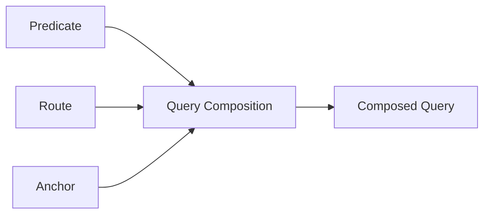

---

### Notes

FIXME:
> Definition says:  Predicate Route Anchor Inputs
> Diagram includes: PredicateSQL FilterContract which are not listed as inputs.
> The diagram and text should describe the same abstraction level.

## Process: Predicate Resolution

### Type

Domain Process

### Definition

The process of transforming a [Predicate](#concept-predicate) into a [Predicate Plan](#concept-predicate-plan) by resolving how the Predicate applies to the [Anchor](#concept-anchor) required by a [Composed Query](#concept-composed-query).

### Description

Predicate Resolution determines how a logical filtering condition can participate in a Composed Query.

A Predicate starts as domain-level filtering intent, such as `Country = Sweden` or `Taxon = Betula`. Before it can be combined with other predicates, it must be resolved to the common Anchor used by the Composed Query.

Predicate Resolution uses [Route Resolution](#process-route-resolution) to identify the Route from the Predicate's Category to the required Anchor. The result is a Predicate Plan that describes how the Predicate should be applied, without yet being executable SQL.

### Inputs

| Input       | Description                                |
|-------------|--------------------------------------------|
| Predicate   | The logical filtering condition to resolve |
| Category    | The Category the Predicate belongs to      |
| Anchor      | The required Anchor for the Composed Query |
| Route Graph | The known set of valid Routes              |

### Outputs

| Output         | Description                                                                     |
|----------------|---------------------------------------------------------------------------------|
| Predicate Plan | A technology-independent plan for applying the Predicate to the required Anchor |

### Relationships

| Relationship | Concept          |
|--------------|------------------|
| resolves     | Predicate        |
| uses         | Route Resolution |
| uses         | Route Graph      |
| selects      | Route            |
| produces     | Predicate Plan   |
| supports     | Composed Query   |

### Diagram

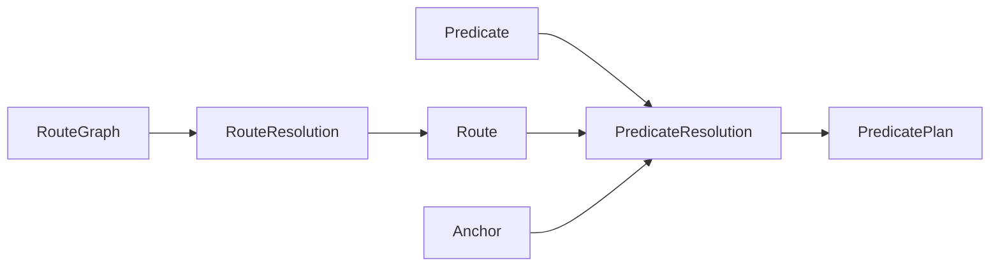

---

## Process: Route Resolution

### Type

Domain Process

### Definition

The process of selecting a valid Route that connects a Predicate's Category to the Anchor required by a Composed Query.

### Description

Route Resolution determines how a Predicate can be resolved to the common Anchor used by a Composed Query.

When a Predicate is created from a Category Value, the system must know how that Category relates to the Anchor being counted or filtered. Route Resolution uses the Route Graph to find a valid traversal from the Predicate's Category to the required Anchor.

The result of Route Resolution is a Route that can be used during Predicate Planning and Predicate SQL generation.

### Inputs

| Input       | Description                                           |
|-------------|-------------------------------------------------------|
| Predicate   | The filtering condition that must be resolved         |
| Category    | The classification dimension the Predicate belongs to |
| Anchor      | The required target Anchor                            |
| Route Graph | The known set of valid Routes                         |

### Output

| Output | Description                                                         |
|--------|---------------------------------------------------------------------|
| Route  | The selected path connecting the Predicate's Category to the Anchor |

### Relationships

| Relationship | Concept        |
|--------------|----------------|
| resolves     | Predicate      |
| uses         | Route Graph    |
| selects      | Route          |
| connects     | Category       |
| connects to  | Anchor         |
| supports     | Predicate Plan |
| supports     | Composed Query |

### Example

Given:

- Predicate: Country = Sweden
- Category: Country
- Required Anchor: Site

Route Resolution selects a Route such as:

```text
Location → Site
```

Given:

- Predicate: Taxon = Betula
- Category: Taxon
- Required Anchor: Sample

Route Resolution may select a Route such as:

```text
Taxon → Analysis Entity → Sample
```

### Notes

Route Resolution is a domain process, not a database query.

It determines which logical traversal should be used before executable Predicate SQL is generated.

If no valid Route exists from the Predicate's Category to the required Anchor, the Predicate cannot participate in the Composed Query for that Anchor.

---

## Process: Category Value Count Calculation

### Type

Domain Process

### Definition

The process of determining the number of Anchors associated with each Category Value within the context of a Composed Query.

### Description

Category Value Count Calculation produces the counts displayed in Facet Content.

Given a Composed Query and a Target Facet, the process determines how many Anchors are associated with each Category Value of the Target Facet after all active Predicate Facets have been applied.

The resulting counts allow users to understand the distribution of Anchors across the available Category Values.

### Inputs

| Input                      | Description                                           |
|----------------------------|-------------------------------------------------------|
| Composed Query             | The query context defining the active filtering state |
| Target Facet               | The Facet being populated                             |
| Category                   | The Category represented by the Target Facet          |
| Resolved Anchor Collection | The Anchors selected by the Composed Query            |

### Outputs

| Output               | Description                                          |
|----------------------|------------------------------------------------------|
| Category Value Count | The count associated with a Category Value           |
| Facet Content        | The complete set of Category Values and their counts |

### Relationships

| Relationship   | Concept              |
|----------------|----------------------|
| consumes       | Composed Query       |
| consumes       | Anchor               |
| consumes       | Category Value       |
| produces       | Category Value Count |
| contributes to | Facet Content        |
| performed for  | Target Facet         |

### Diagram

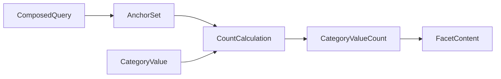

### Example

Given:

- Target Facet = Country
- Predicate Facets:
  - Time Period = Neolithic
  - Taxon = Betula

The Composed Query produces a collection of resolved Anchors i.e. all matching sites.

Category Value Count Calculation determines how many Anchors belong to each Country:

| Category Value | Category Value Count |
|----------------|----------------------|
| Sweden         | 234                  |
| Norway         | 118                  |
| Finland        | 57                   |

These counts become part of the Facet Content returned for the Country Facet.

### Notes

Category Value Count Calculation is performed after Query Composition has produced a Composed Query.

Counts are calculated against the resulting collection of resolved Anchors, not directly against database rows.

The same Category Value may have different Category Value Counts in different Composed Queries because the active Predicate Facets may differ.

This process answers the question:

> Given the current Composed Query, how many Anchors are associated with each Category Value of the Target Facet?

---

## Process: Facet Content Generation

### Type

Type: Domain Process

### Definition

The process of producing Facet Content from a Composed Query.

### Inputs

- Composed Query
- Target Facet

### Output

- Facet Content


### Sub-processes

- __Category Value Discovery__
- Category Value Count Calculation
- __Facet Content Assembly__

### Diagram

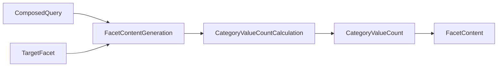


### Relationships

| Relationship | Concept                          |
|--------------|----------------------------------|
| consumes     | Composed Query                   |
| consumes     | Target Facet                     |
| performs     | Category Value Count Calculation |
| produces     | Facet Content                    |


---


# Part C — Architectural Concepts

## Concept: Contract

### Type

Architectural Concept

### Definition

An explicit agreement between components specifying inputs, outputs, and guarantees.

### Description

Contracts define how components interact while remaining independent of each other's internal implementation.

### Relationships

| Relationship   | Concept          |
|----------------|------------------|
| specialized by | Request Contract |
| specialized by | Filter Contract  |
| specialized by | Result Contract  |
| implemented by | DTO              |

### Diagram

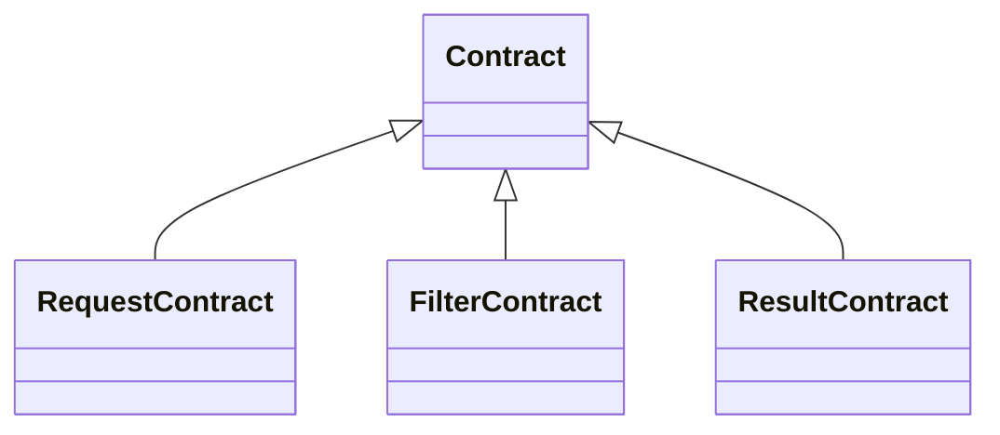


---

## Concept: Request Contract

### Type

Architectural Concept

### Definition

A contract describing everything required to initiate a unit of work.

### Description

A Request Contract contains the validated information required to construct and execute a Composed Query. It acts as the entry point to the processing pipeline and provides a stable interface between request construction and request execution.

### Relationships

| Relationship     | Concept             |
|------------------|---------------------|
| represents       | Composed Query      |
| enters           | Validation Boundary |
| enters           | Pipeline            |
| specialized from | Contract            |

### Implementation Examples

- ComposedFacetContentRequest

---


## Concept: Filter Contract

### Type

Architectural Concept

### Definition

A contract describing the filtered collection of resolved Anchors produced by active predicates.

### Description

The Filter Contract represents a Composed Query after active predicate facets have been resolved to a common anchor and combined into a unified filtering context.

### Relationships

| Relationship     | Concept        |
|------------------|----------------|
| represents       | Composed Query |
| produced from    | Predicate SQL  |
| contributes to   | Facet Content  |
| specialized from | Contract       |

### Implementation Examples

- ComposedFilterQuery

---

## Concept: Result Contract

### Type

Architectural Concept

### Definition

A Contract that describes the information returned by a completed operation.

### Description

A Result Contract defines the shape and guarantees of data returned from a Pipeline or service operation.

For facet-content requests, the Result Contract represents the generated Facet Content. It describes what downstream callers can expect after a Composed Query has been processed, without exposing the internal steps used to produce the result.

A Result Contract is architectural: it is not the same thing as Facet Content itself. It is the contract used to carry or expose Facet Content across a Boundary.

### Relationships

| Relationship   | Concept                  |
|----------------|--------------------------|
| specializes    | Contract                 |
| represents     | Facet Content            |
| produced by    | Pipeline                 |
| returned after | Facet Content Generation |
| implemented by | DTO                      |
| crosses        | Boundary                 |

### Implementation Examples

- FacetContent
- ResultContentSet

### Notes

A Result Contract describes the returned data structure and its guarantees.

Facet Content is the domain result; the Result Contract is the architectural representation of that result.

---

## Concept: Boundary

### Type

Architectural Concept

### Definition

A deliberate separation between areas of responsibility within a system.

### Description

A Boundary defines where responsibility changes from one component, layer, or subsystem to another. Crossing a boundary typically involves a Handoff governed by a Contract.

### Relationships

| Relationship | Concept   |
|--------------|-----------|
| crossed by   | Handoff   |
| governed by  | Contract  |
| separates    | Ownership |

### Notes

Examples include service boundaries, layer boundaries, and validation boundaries.

---

## Concept: Validation Boundary

### Type

Architectural Concept

### Definition

The Boundary where incoming requests are checked before they are allowed to enter the trusted processing Pipeline.

### Description

The Validation Boundary separates untrusted or partially constructed input from the part of the system that assumes requests are valid.

At this boundary, the system verifies that a Request Contract is complete, consistent, and satisfies required Invariants. After a request crosses the Validation Boundary, downstream components should be able to rely on the request structure without repeating the same validation checks.

### Relationships

| Relationship | Concept          |
|--------------|------------------|
| specializes  | Boundary         |
| validates    | Request Contract |
| enforces     | Invariant        |
| precedes     | Trust Boundary   |
| protects     | Pipeline         |

### Examples

A Validation Boundary may check that:

- A Target Facet is present.
- Active Predicate Facets are valid.
- Predicates can resolve to the required Anchor.
- Required Routes exist.
- The request satisfies Composed Query invariants.

### Notes

The Validation Boundary is an architectural concept.

It does not create the Composed Query itself. It ensures that the request is safe and consistent before Composed Query processing continues.

---

## Concept: Trust Boundary

### Type

Architectural Concept

### Definition

The point after which downstream components may assume that inputs are valid.

### Description

After crossing the Trust Boundary, components can rely on the correctness of routes, Anchors, predicates, and request structure without performing additional defensive validation.

### Relationships

| Relationship | Concept             | Description                                                         |
|--------------|---------------------|---------------------------------------------------------------------|
| follows      | Validation Boundary | A trust boundary is typically accompanied by a validation boundary. |
| precedes     | Pipeline            |                                                                     |

## Notes

Relationship to contracts

This is where things get interesting.

At a normal architectural boundary:

Producer
   |
Contract
   |
Consumer

the contract describes what should happen.

At a trust boundary:

Producer
   |
Contract
   |
Validation
   |
Consumer

the contract must be enforced because the other side might violate it.

A common security principle is:

> Never trust data that crosses a trust boundary.

Even if there is a contract.

```text
Trust Boundary
      ↓
Validation Boundary
      ↓
Contract
      ↓
Handoff
      ↓
Pipeline Stage
```

Meaning:

1. Trust changes.
2. Validation occurs.
3. Contract is enforced.
4. Handoff happens.
5 Processing continues through the pipeline.

---

## Concept: Handoff

### Type

Architectural Concept

### Definition

The transfer of responsibility from one component to another.

### Description

A handoff marks the point where one component completes its work and another assumes responsibility.

### Relationships

| Relationship      | Concept  |
|-------------------|----------|
| occurs at         | Boundary |
| transfers between | Producer |
| transfers between | Consumer |
| carries           | DTO      |

### Diagram

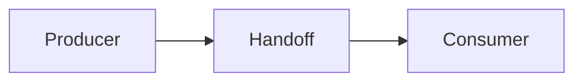
---

## Concept: Producer

### Type

Architectural Concept

### Definition

A component that creates or supplies information for use by other components.

### Description

A Producer is responsible for generating a specific artifact and making it available to downstream consumers. Producers own creation but not subsequent processing.

### Relationships

| Relationship     | Concept  |
|------------------|----------|
| transfers via    | Handoff  |
| supplies         | Consumer |
| owns creation of | Contract |

### Notes

Factories, builders, resolvers, and query composers often act as producers.

---

## Concept: Consumer

### Type

Architectural Concept

### Definition

A component that receives and uses information produced by another component.

### Description

A Consumer relies on the guarantees provided by a Contract and uses the information it receives to perform further processing.

### Relationships

| Relationship  | Concept  |
|---------------|----------|
| receives via  | Handoff  |
| depends on    | Contract |
| receives from | Producer |

### Notes

Handlers, orchestrators, compilers, and controllers often act as consumers.

---

---

## Concept: Orchestrator

### Type

Architectural Concept

### Definition

A component responsible for coordinating the work of other components.

### Description

The Orchestrator delegates work to specialized components and assembles their results into a completed operation.

### Relationships

| Relationship | Concept  |
|--------------|----------|
| coordinates  | Pipeline |
| delegates to | Producer |
| delegates to | Consumer |

### Diagram

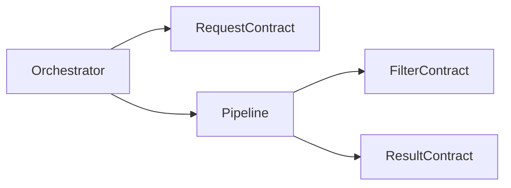

---

## Concept: Pipeline

### Type

Architectural Concept

### Definition

An ordered sequence of transformations that converts a request into facet content.

### Description

The Pipeline coordinates the transformation of validated requests through multiple intermediate representations until the final result is produced.

### Relationships

| Relationship   | Concept                          |
|----------------|----------------------------------|
| consumes       | Request Contract                 |
| produces       | Result Contract                  |
| uses           | Intermediate Representation (IR) |
| coordinated by | Orchestrator                     |

### Diagram

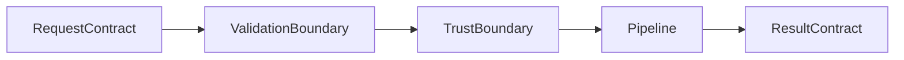

### Implementation Examples

- FacetsConfig → ComposedFacetContentRequest → ComposedFilterQuery → FacetContent

---

## Concept: Intermediate Representation (IR)

### Type

Architectural Concept

### Definition

A data structure used to transfer information between stages in a pipeline.

### Description

IRs decouple pipeline stages by providing a stable representation between transformations.

### Relationships

| Relationship | Concept         |
|--------------|-----------------|
| used by      | Pipeline        |
| includes     | Predicate Plan  |
| includes     | Filter Contract |

---

## Concept: Invariant

### Type

Architectural Concept

### Definition

A condition that must always hold true for the system to produce correct results.

### Description

Invariants define correctness rules that are enforced throughout the system.

### Relationships

| Relationship | Concept             |
|--------------|---------------------|
| enforced at  | Validation Boundary |
| constrains   | Anchor              |

### Examples

- All predicates must resolve to the same anchor.
- Every valid request must contain a target facet.

---

Given the direction of your glossary, I'd define these as architectural concepts that focus on **responsibility and interaction**, not implementation.

---

## Concept: Ownership

### Type

Architectural Concept

### Definition

The responsibility of a component for a specific concern, capability, or artifact.

### Description

Ownership establishes which component is responsible for creating, validating, modifying, or maintaining a particular piece of functionality. Clear ownership reduces coupling and ambiguity.

### Relationships

| Relationship | Concept    |
|--------------|------------|
| separated by | Boundary   |
| respected by | Delegation |
| assigned to  | Producer   |
| assigned to  | Consumer   |

### Notes

A component should ideally own one concern and perform one primary responsibility.

---

## Concept: Delegation

### Type

Architectural Concept

### Definition

The act of assigning responsibility for a specific task to another component.

### Description

Delegation allows components to coordinate work without performing every task themselves. It enables specialization while preserving clear ownership boundaries.

### Relationships

| Relationship      | Concept      |
|-------------------|--------------|
| performed by      | Orchestrator |
| respects          | Ownership    |
| transfers work to | Producer     |
| transfers work to | Consumer     |

### Notes

Delegation transfers responsibility for a task, but not ownership of the overall operation.

---

