# Glossary

This glossary defines the canonical terminology for the SEAD Query API.

Concepts are classified as either:

- **Domain Concepts** — concepts from the problem domain, independent of implementation.
- **Architectural Concepts** — concepts describing software organization, responsibilities, interactions, and implementation patterns.

## Terminology Rules

- Define each concept once.
- Use canonical names.
- Prefer references to existing concepts over repeating definitions.
- Relationships should reference other glossary concepts whenever possible.
- Implementation classes, DTOs, tables, services, and APIs are examples, not concepts.
- Domain concepts describe the problem domain.
- Architectural concepts describe software organization and responsibilities.
- Mermaid diagrams must not introduce undefined concepts.

---

## Concept Map

### Query Composition

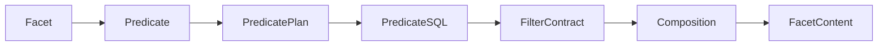

### Processing Pipeline

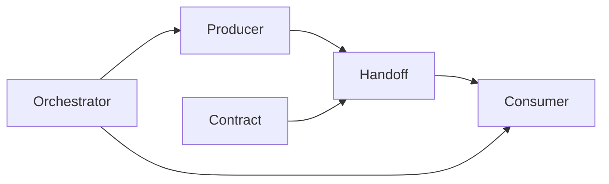

---

# Part A — Domain Concepts

## Concept: Request Contract

### Type

Architectural Concept

### Definition

A contract describing everything required to initiate a unit of work.

### Description

A Request Contract contains the validated information required to process a request. It acts as the entry point to the processing pipeline and provides a stable interface between request construction and request execution.

### Relationships

| Relationship | Concept |
|--------------|----------|
| enters | Validation Boundary |
| enters | Pipeline |
| specialized from | Contract |

### Implementation Examples

- ComposedFacetContentRequest

---

## Concept: Validation Boundary

### Type

Architectural Concept

### Definition

The point where requests are validated before further processing.

### Description

The Validation Boundary ensures that requests are structurally complete and satisfy all required invariants before they are allowed to proceed downstream.

### Relationships

| Relationship | Concept |
|--------------|----------|
| validates | Request Contract |
| precedes | Trust Boundary |
| enforces | Invariant |

---

## Concept: Trust Boundary

### Type

Architectural Concept

### Definition

The point after which downstream components may assume that inputs are valid.

### Description

After crossing the Trust Boundary, components can rely on the correctness of routes, anchors, predicates, and request structure without performing additional defensive validation.

### Relationships

| Relationship | Concept |
|--------------|----------|
| follows | Validation Boundary |
| precedes | Pipeline |

---

## Concept: Pipeline

### Type

Architectural Concept

### Definition

An ordered sequence of transformations that converts a request into facet content.

### Description

The Pipeline coordinates the transformation of validated requests through multiple intermediate representations until the final result is produced.

### Relationships

| Relationship | Concept |
|--------------|----------|
| consumes | Request Contract |
| produces | Result Contract |
| uses | Intermediate Representation (IR) |
| coordinated by | Orchestrator |

### Diagram

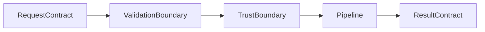

---

## Concept: Predicate Plan

### Type

Domain Concept

### Definition

A technology-independent representation of a predicate.

### Description

A Predicate Plan describes filtering intent before it is translated into executable SQL. It serves as an intermediate representation between user intent and query execution.

### Relationships

| Relationship | Concept |
|--------------|----------|
| produced from | Predicate |
| compiled into | Predicate SQL |
| is a | Intermediate Representation (IR) |

---

## Concept: Predicate SQL

### Type

Domain Concept

### Definition

The executable SQL representation of a predicate.

### Description

Predicate SQL is the database-specific form of a predicate used during query execution.

### Relationships

| Relationship | Concept |
|--------------|----------|
| produced from | Predicate Plan |
| contributes to | Filter Contract |

### Diagram

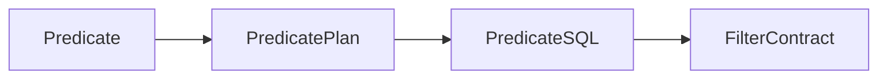

---

## Concept: Filter Contract

### Type

Architectural Concept

### Definition

A contract describing the filtered anchor set produced by active predicates.

### Description

The Filter Contract represents the combined filtering state after all predicates have been resolved and composed.

### Relationships

| Relationship | Concept |
|--------------|----------|
| produced from | Predicate SQL |
| consumed by | Composition |
| specialized from | Contract |

### Implementation Examples

- ComposedFilterQuery

---

## Concept: Composition

### Type

Domain Concept

### Definition

The process of combining predicate results into a unified result set.

### Description

Composition merges all predicate results at a common anchor and produces the information required to populate facet content.

### Relationships

| Relationship | Concept |
|--------------|----------|
| consumes | Filter Contract |
| produces | Facet Content |
| requires | Anchor |

### Diagram

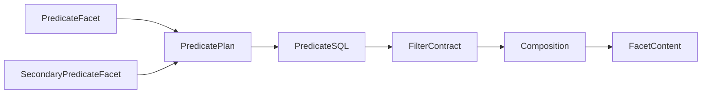

---

## Concept: Anchor

### Type

Domain Concept

### Definition

The common entity to which all predicates must resolve before composition.

### Description

The Anchor acts as the convergence point for all filter paths. Predicate results cannot be composed until they have been resolved to a common anchor.

### Relationships

| Relationship | Concept |
|--------------|----------|
| required by | Composition |
| constrained by | Invariant |
| referenced by | Filter Contract |

### Diagram

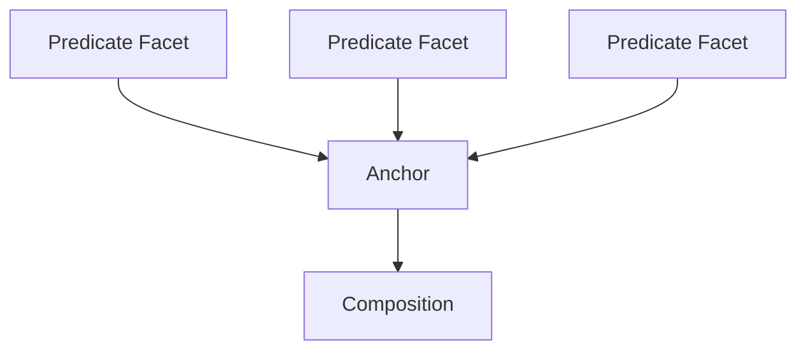

---

## Concept: Contract

### Type

Architectural Concept

### Definition

An explicit agreement between components specifying inputs, outputs, and guarantees.

### Description

Contracts define how components interact while remaining independent of each other's internal implementation.

### Relationships

| Relationship | Concept |
|--------------|----------|
| specialized by | Request Contract |
| specialized by | Filter Contract |
| specialized by | Result Contract |
| implemented by | DTO |

### Diagram

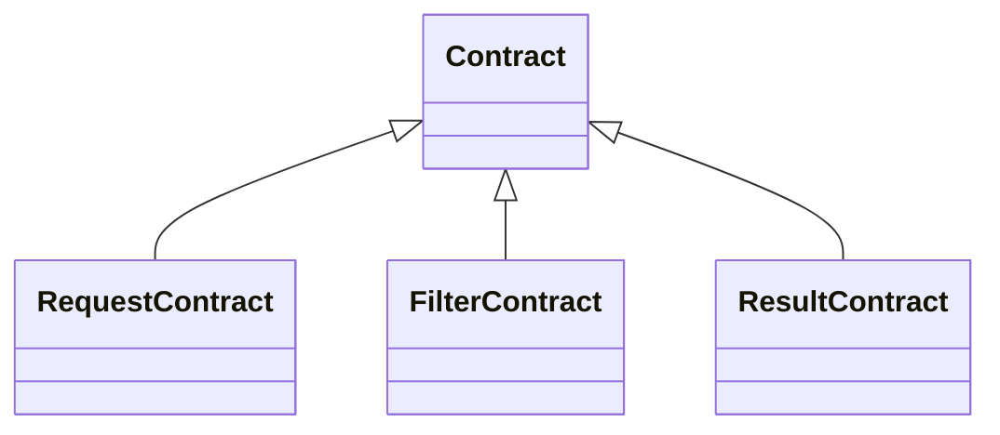

---

## Concept: Orchestrator

### Type

Architectural Concept

### Definition

A component responsible for coordinating the work of other components.

### Description

The Orchestrator delegates work to specialized components and assembles their results into a completed operation.

### Relationships

| Relationship | Concept |
|--------------|----------|
| coordinates | Pipeline |
| delegates to | Producer |
| delegates to | Consumer |

### Diagram

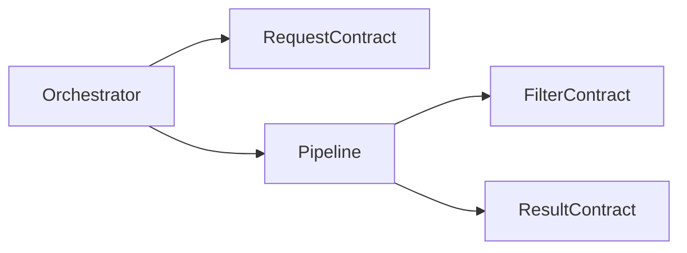

### Implementation Examples

- ComposedFacetContentService

---

## Concept: Facet

### Type

Domain Concept

### Definition

A configurable filter dimension that users interact with to narrow query results.

### Description

Facets are the central filtering concept in the system. Common examples include Country, Taxon, and Time Period. Each facet presents categories with associated counts, allowing users to progressively refine their search.

### Relationships

| Relationship | Concept |
|--------------|----------|
| validated by | Request Contract |
| transformed by | Consumer |
| contains | Category |

### Diagram

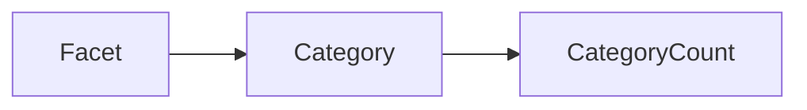

### Implementation Examples

- FacetConfig

### Notes

A facet is a domain concept. Configuration objects are implementation details that represent facets.

---

## Concept: Target Facet

### Type

Domain Concept

### Definition

The facet currently being populated with category counts.

### Description

While loading categories for the Country facet, Country is the target facet. The target facet determines which resolution strategy and handler are used.

### Relationships

| Relationship | Concept |
|--------------|----------|
| participates in | Request Contract |
| processed by | Pipeline |
| selected from | Facet |

---

## Concept: Predicate Facet

### Type

Domain Concept

### Definition

A facet that actively contributes filtering logic by narrowing the result set.

### Description

When a user selects Country = Sweden while browsing the Taxon facet, Country acts as a predicate facet.

### Relationships

| Relationship | Concept |
|--------------|----------|
| transformed into | Predicate Plan |
| contributes to | Filter Contract |
| specializes | Facet |

---

## Concept: Anchor

### Type

Domain Concept

### Definition

The common entity to which all facets must resolve before their predicates can be combined.

### Description

An anchor is the convergence point for all filter paths. Common anchors include site, sample, and taxon.

### Relationships

| Relationship | Concept |
|--------------|----------|
| constrained by | Invariant |
| referenced by | Request Contract |
| referenced by | Filter Contract |

### Diagram

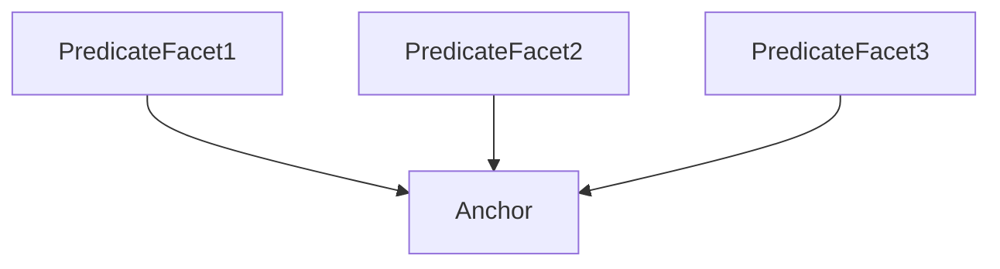

### Implementation Examples

- site
- sample
- taxon

---

## Concept: Predicate Plan

### Type

Domain Concept

### Definition

An intermediate, technology-independent representation of a predicate.

### Description

A Predicate Plan describes filtering intent before it is translated into executable SQL.

### Relationships

| Relationship | Concept |
|--------------|----------|
| compiled into | Predicate SQL |
| is a | Intermediate Representation (IR) |
| produced from | Predicate |

---

# Part B — Architectural Concepts

## Concept: Contract

### Type

Architectural Concept

### Definition

An explicit agreement between components specifying inputs, outputs, and guarantees.

### Description

Contracts allow components to collaborate without knowledge of each other's internal implementation.

### Relationships

| Relationship | Concept |
|--------------|----------|
| implemented by | DTO |
| specialized by | Request Contract |
| specialized by | Filter Contract |
| specialized by | Result Contract |

### Diagram

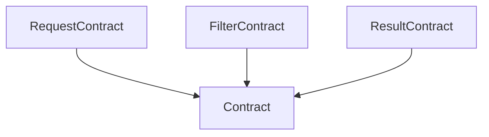

---

## Concept: Handoff

### Type

Architectural Concept

### Definition

The transfer of responsibility from one component to another.

### Description

A handoff marks the point where one component completes its work and another assumes responsibility.

### Relationships

| Relationship | Concept |
|--------------|----------|
| occurs at | Boundary |
| transfers between | Producer |
| transfers between | Consumer |
| carries | DTO |

### Diagram

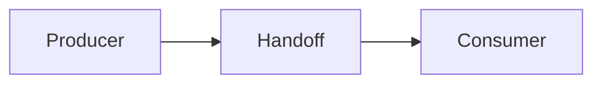

---

## Concept: Pipeline

### Type

Architectural Concept

### Definition

An ordered sequence of transformations that converts input into output.

### Description

The pipeline transforms requests into results through a series of stages connected by intermediate representations.

### Relationships

| Relationship | Concept |
|--------------|----------|
| coordinated by | Orchestrator |
| uses | Intermediate Representation (IR) |
| produces | Result Contract |
| consumes | Request Contract |

### Implementation Examples

- FacetsConfig → ComposedFacetContentRequest → ComposedFilterQuery → FacetContent

---

## Concept: Intermediate Representation (IR)

### Type

Architectural Concept

### Definition

A data structure used to transfer information between stages in a pipeline.

### Description

IRs decouple pipeline stages by providing a stable representation between transformations.

### Relationships

| Relationship | Concept |
|--------------|----------|
| used by | Pipeline |
| includes | Predicate Plan |
| includes | Request Contract |

---

## Concept: Invariant

### Type

Architectural Concept

### Definition

A condition that must always hold true for the system to produce correct results.

### Description

Invariants define correctness rules that are enforced throughout the system.

### Relationships

| Relationship | Concept |
|--------------|----------|
| enforced at | Validation Boundary |
| constrains | Anchor |

### Examples

- All predicates must resolve to the same anchor.
- Every valid request must contain a target facet.

---