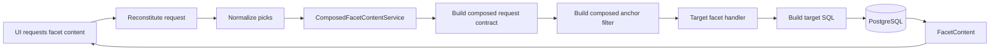
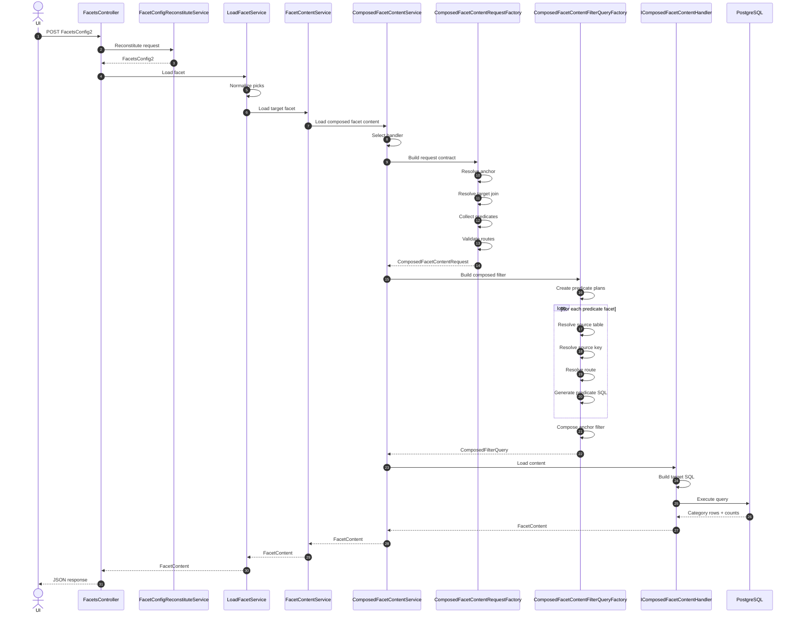
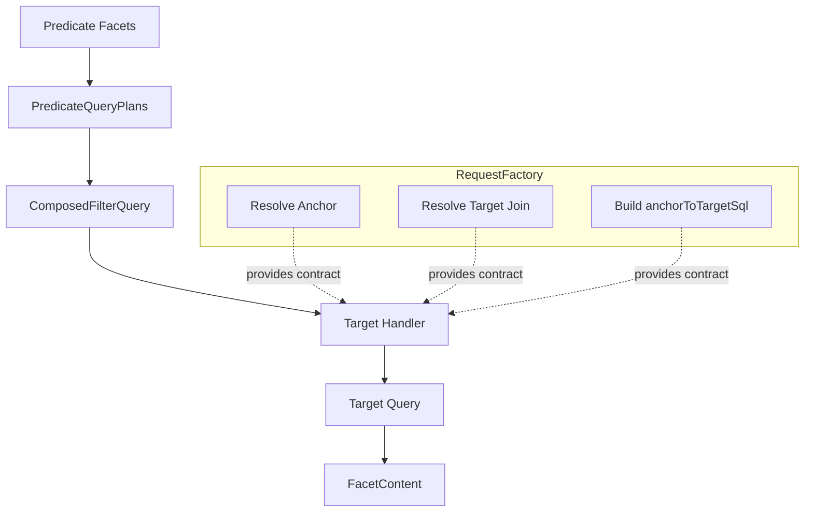
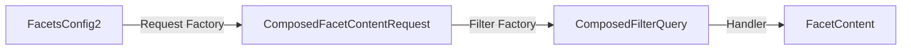

# Use Cases

## Use case: Load content for a selected target facet (query-engine overhaul path)

This use case describes the composed facet-content runtime introduced by
[COMPOSED_FACET_CONTENT_SERVICE_REDESIGN.md](proposals/done/COMPOSED_FACET_CONTENT_SERVICE_REDESIGN.md),
extended by
[INLINE_SQL_FACET_TEMPLATES_AS_DEFAULT_AUTHORING.md](proposals/INLINE_SQL_FACET_TEMPLATES_AS_DEFAULT_AUTHORING.md),
and summarized in [DESIGN.md](DESIGN.md).

It describes the current composed facet-content path as implemented in code. It is not a legacy fallback scenario.

### Goal

The UI needs the content for one target facet, such as category rows and counts for `country`, while respecting the current request context, the active predicate facets, the target facet type, and any imported inline facet-template metadata.

### Primary actors

- UI client
- [FacetsController](../sead.query.api/Controllers/FacetsController.cs)
- [FacetConfigReconstituteService](../sead.query.api/Services/Reconstitute/FacetConfigReconstituteService.cs)
- [LoadFacetService](../sead.query.api/Services/LoadFacetService.cs)
- [FacetContentService](../sead.query.core/Services/FacetContent/FacetContentService.cs)
- [ComposedFacetContentService](../sead.query.composer/QueryComposer/Services/ComposedFacetContentService.cs)
- [ComposedFacetContentRequestFactory](../sead.query.composer/QueryComposer/Services/ComposedFacetContentRequestFactory.cs)
- [ComposedFacetContentFilterQueryFactory](../sead.query.composer/QueryComposer/Services/ComposedFacetContentFilterQueryFactory.cs)
- The target-specific handlers:
  [DiscreteComposedFacetContentHandler](../sead.query.composer/QueryComposer/Services/DiscreteComposedFacetContentHandler.cs),
  [RangeComposedFacetContentHandler](../sead.query.composer/QueryComposer/Services/RangeComposedFacetContentHandler.cs),
  [IntersectComposedFacetContentHandler](../sead.query.composer/QueryComposer/Services/IntersectComposedFacetContentHandler.cs),
  and [GeoPolygonComposedFacetContentHandler](../sead.query.composer/QueryComposer/Services/GeoPolygonComposedFacetContentHandler.cs)
- PostgreSQL, reached through `ITypedQueryProxy`

### Main code path

- The HTTP entry point is [FacetsController.Load](../sead.query.api/Controllers/FacetsController.cs).
- Request reconstitution happens in [FacetConfigReconstituteService](../sead.query.api/Services/Reconstitute/FacetConfigReconstituteService.cs).
- Pick normalization happens in [LoadFacetService](../sead.query.api/Services/LoadFacetService.cs).
- The runtime handoff into composed execution is [FacetContentService.Load](../sead.query.core/Services/FacetContent/FacetContentService.cs).
- The composed orchestrator is [ComposedFacetContentService](../sead.query.composer/QueryComposer/Services/ComposedFacetContentService.cs).
- The target request contract is built in [ComposedFacetContentRequestFactory](../sead.query.composer/QueryComposer/Services/ComposedFacetContentRequestFactory.cs).
- The composed anchor filter is built in [ComposedFacetContentFilterQueryFactory](../sead.query.composer/QueryComposer/Services/ComposedFacetContentFilterQueryFactory.cs).
- The target SQL plan is assembled by [DiscreteFacetContentQueryComposer](../sead.query.core/QueryComposer/Strategies/DiscreteFacetContentQueryComposer.cs), which now also covers range, intersect, and geo-polygon target SQL shapes.
- Imported inline template metadata is persisted by [FacetRouteConfigurationImporter](../sead.query.infra/Configuration/FacetRouteConfigurationImporter.cs) and loaded at runtime by [FacetTemplateRuntimeResolver](../sead.query.infra/Configuration/FacetTemplateRuntimeResolver.cs).

### Main scenario

1. **The UI asks to populate one target facet.**
   The client posts a `FacetsConfig2` payload to [FacetsController.Load](../sead.query.api/Controllers/FacetsController.cs).

2. **The API reconstitutes the runtime request model.**
   [FacetConfigReconstituteService](../sead.query.api/Services/Reconstitute/FacetConfigReconstituteService.cs) resolves `TargetFacet`, `DomainFacet`, and each `FacetConfig2.Facet` from repository-backed facet metadata, then validates the reconstituted `FacetsConfig2`.

3. **The load service normalizes picks before content loading begins.**
   [LoadFacetService](../sead.query.api/Services/LoadFacetService.cs) applies `ISupportedRequestPickSanitizer.Update(...)` and then delegates to [FacetContentService.Load](../sead.query.core/Services/FacetContent/FacetContentService.cs).

4. **The facet-content service enters the composed runtime directly.**
   [FacetContentService](../sead.query.core/Services/FacetContent/FacetContentService.cs) no longer chooses between a live legacy path and a composed path here. It delegates directly to [ComposedFacetContentService.Load](../sead.query.composer/QueryComposer/Services/ComposedFacetContentService.cs).

5. **The composed orchestrator resolves the target handler.**
   [ComposedFacetContentService](../sead.query.composer/QueryComposer/Services/ComposedFacetContentService.cs) selects an `IComposedFacetContentHandler` by `TargetFacet.FacetTypeId`. This is the strategy split introduced by the redesign.

6. **The composed request contract is validated and built.**
   [ComposedFacetContentRequestFactory](../sead.query.composer/QueryComposer/Services/ComposedFacetContentRequestFactory.cs) performs the request-construction work that used to be mixed into the service:
   - resolve the aggregate facet and its anchor table
   - derive the anchor key column from the aggregate facet
   - derive the target join column through the selected handler
   - collect the predicate facet configs that affect the target
   - include the domain config when it has picks or enforced constraints
   - validate each secondary predicate facet against the composed contract
   - compile `anchorToTargetSql` when the target table is not the anchor table

7. **The request factory rejects unsupported predicate shapes early.**
   The same factory currently limits secondary predicates to supported discrete predicate facets. It fails explicitly when:
   - the predicate facet type is not supported as a secondary predicate
   - the predicate facet does not expose a simple source key column
   - the predicate criteria cannot be normalized for the composed predicate path
   - the predicate source table cannot be routed to the anchor table
   - the target join column or target route cannot be derived

8. **The composed anchor filter is built from predicate plans.**
   [ComposedFacetContentFilterQueryFactory](../sead.query.composer/QueryComposer/Services/ComposedFacetContentFilterQueryFactory.cs) turns the validated predicate configs into `PredicateQueryPlan` instances.

9. **Each predicate plan resolves its own source-side SQL contract.**
   For each predicate facet, the filter-query factory:
   - resolves the source table
   - resolves the source key column
   - resolves supported predicate criteria
   - determines whether the route to the anchor is an identity route or a routed trail
   - delegates SQL generation to `IDiscreteFacetPredicateResolver`

10. **Imported inline template metadata can override the predicate SQL shape.**
    Before calling the predicate resolver, [ComposedFacetContentFilterQueryFactory](../sead.query.composer/QueryComposer/Services/ComposedFacetContentFilterQueryFactory.cs) loads a runtime snapshot from [FacetTemplateRuntimeResolver](../sead.query.infra/Configuration/FacetTemplateRuntimeResolver.cs). If the facet has an anchor-specific SQL exception for the current anchor table, that SQL is passed into `AnchorTemplate.ExplicitSql` and becomes the predicate source for that route.

11. **If the request has no predicate facets, the runtime still creates an anchor set.**
    [ComposedFacetContentFilterQueryFactory](../sead.query.composer/QueryComposer/Services/ComposedFacetContentFilterQueryFactory.cs) emits an explicit unfiltered anchor query through `ComposedFacetContentSupport.CreateUnfilteredAnchorSql(...)`. This is the basis for target-only composed requests.

12. **The composed filter query is materialized.**
    When one or more predicate plans exist, `IComposedFilterQueryComposer` combines them into one composed anchor-set SQL contract. The output keeps the anchor table and anchor key alias that downstream target rendering expects.

13. **The selected target handler builds the target facet-content query.**
    The handler receives:
    - the normalized `FacetsConfig2`
    - the `ComposedFacetContentRequest`
    - the `ComposedFilterQuery`

14. **The target query composer builds the SQL plan.**
    [DiscreteFacetContentQueryComposer](../sead.query.core/QueryComposer/Strategies/DiscreteFacetContentQueryComposer.cs) materializes the final target query. Depending on target type, the plan may include:
    - `composed_filter` as the anchor-set CTE
    - `target_route` when the target table differs from the anchor table
    - `categories` and `outerbounds` for range and intersect targets
    - target-table joins and enforced target-side criteria

15. **The handler executes the SQL and maps rows into `FacetContent`.**
    The selected handler uses `ITypedQueryProxy.QueryRows(...)` to execute the plan and map rows into `CategoryItem` values, then returns a `FacetContent` object with items, distribution, SQL, and user picks.

16. **The API returns the facet response to the UI.**
    The `FacetContent` result flows back through [ComposedFacetContentService](../sead.query.composer/QueryComposer/Services/ComposedFacetContentService.cs), [FacetContentService](../sead.query.core/Services/FacetContent/FacetContentService.cs), and [LoadFacetService](../sead.query.api/Services/LoadFacetService.cs) to [FacetsController.Load](../sead.query.api/Controllers/FacetsController.cs), which returns JSON to the client.

### Sub use case: discrete target with secondary discrete predicates

This is the baseline composed case.

1. The target facet is discrete.
2. One or more earlier facet configs contribute picks as secondary predicates.
3. [ComposedFacetContentRequestFactory](../sead.query.composer/QueryComposer/Services/ComposedFacetContentRequestFactory.cs) validates that each secondary predicate facet is discrete, routable, and exposes a supported source key and criteria shape.
4. [ComposedFacetContentFilterQueryFactory](../sead.query.composer/QueryComposer/Services/ComposedFacetContentFilterQueryFactory.cs) resolves one predicate SQL plan per secondary facet.
5. The composed filter composer intersects those anchor-key queries.
6. [DiscreteComposedFacetContentHandler](../sead.query.composer/QueryComposer/Services/DiscreteComposedFacetContentHandler.cs) renders grouped categories and counts for the target facet.

### Sub use case: target-only discrete facet on the anchor table

This is the simplest zero-predicate composed case.

1. The target facet is discrete.
2. There are no predicate facet configs after normalization.
3. The target table is the same as the anchor table, so no `target_route` SQL is needed.
4. [ComposedFacetContentFilterQueryFactory](../sead.query.composer/QueryComposer/Services/ComposedFacetContentFilterQueryFactory.cs) emits an unfiltered anchor set.
5. [DiscreteComposedFacetContentHandler](../sead.query.composer/QueryComposer/Services/DiscreteComposedFacetContentHandler.cs) loads grouped counts directly from the target table.

### Sub use case: routed target-only discrete facet with outer-category overlay

This is the discrete target-only exception that preserves legacy-compatible zero-count categories.

1. The target facet is discrete.
2. There are no predicate facet configs.
3. The target table differs from the anchor table, so the request factory must build `anchorToTargetSql`.
4. The composed query counts categories reachable through that route.
5. [DiscreteComposedFacetContentHandler](../sead.query.composer/QueryComposer/Services/DiscreteComposedFacetContentHandler.cs) detects the zero-predicate routed case and calls its `CreateTargetOnlyFacetContent(...)` path.
6. The handler loads the legacy-style category-info row set through `IDiscreteCategoryInfoService`, overlays the composed counts onto that outer category set, and returns a result that can still expose zero-count categories.

### Sub use case: range or intersect target facet

These targets share the interval-style handler base.

1. The target facet type is `Range` or `Intersect`.
2. The selected handler is [RangeComposedFacetContentHandler](../sead.query.composer/QueryComposer/Services/RangeComposedFacetContentHandler.cs) or [IntersectComposedFacetContentHandler](../sead.query.composer/QueryComposer/Services/IntersectComposedFacetContentHandler.cs), both built on [IntervalComposedFacetContentHandlerBase](../sead.query.composer/QueryComposer/Services/IntervalComposedFacetContentHandlerBase.cs).
3. The handler loads category-info SQL first through `ICategoryInfoService`.
4. [DiscreteFacetContentQueryComposer](../sead.query.core/QueryComposer/Strategies/DiscreteFacetContentQueryComposer.cs) builds the interval count query using `categories` and `outerbounds` CTEs.
5. The handler executes the counted query, then executes the outer category-info query, and merges counts back onto the full interval row set before returning `FacetContent`.

### Sub use case: geo-polygon target facet

Geo-polygon uses a distinct validation rule.

1. The target facet type is `GeoPolygon`.
2. [GeoPolygonComposedFacetContentHandler](../sead.query.composer/QueryComposer/Services/GeoPolygonComposedFacetContentHandler.cs) rejects the request if additional predicate facets are present.
3. If validation succeeds, the handler loads geo-polygon category-info SQL, composes the target query, maps geometry-aware rows, and returns the facet content distribution.

### Sub use case: inline SQL-backed predicate facet

This is the redesign follow-up added by the inline-template change request.

1. A facet definition is imported with base-template metadata or an explicit anchor-to-SQL exception.
2. [FacetRouteConfigurationImporter](../sead.query.infra/Configuration/FacetRouteConfigurationImporter.cs) persists that data into `facet.facet_template`, including `template_role`, `sql_text`, `template_key`, `template_contract`, and `base_anchor`.
3. [FacetTemplateRuntimeResolver](../sead.query.infra/Configuration/FacetTemplateRuntimeResolver.cs) loads a `FacetTemplateRuntimeSnapshot` at runtime.
4. [ComposedFacetContentFilterQueryFactory](../sead.query.composer/QueryComposer/Services/ComposedFacetContentFilterQueryFactory.cs) reads `AnchorSqlByTable` from that snapshot.
5. If the current predicate facet has an explicit SQL exception for the active anchor table, the factory passes that SQL into the discrete predicate resolver through `AnchorTemplate.ExplicitSql`.
6. The composed facet-content path can therefore execute supported predicate facets without reconstructing all source SQL from legacy relational properties alone.

### Alternative scenario: unsupported request on the composed path

In the current runtime, unsupported facet-content requests fail explicitly in this path.

1. [ComposedFacetContentService](../sead.query.composer/QueryComposer/Services/ComposedFacetContentService.cs) throws when no handler exists for the target facet type.
2. It also throws when [ComposedFacetContentRequestFactory](../sead.query.composer/QueryComposer/Services/ComposedFacetContentRequestFactory.cs) cannot build a valid composed request.
3. The failure is explicit and describes which part of the request shape falls outside the composed contract.

So the key idea is:

> The redesign turns facet-content loading into an explicit orchestration pipeline: reconstitute request, normalize picks, validate a routable anchor contract, compose an anchor filter, delegate target rendering to a facet-type handler, and optionally inject imported inline SQL exceptions where the facet authoring model requires them.

The updated use case is much more detailed than the earlier sequence diagrams because it exposes the **actual orchestration contracts** and the **request factory / filter factory / handler split**. 

I would visualize it using **three diagrams at different zoom levels**.

---

# 1. High-Level Business Flow

This is the diagram I would put near the top of the document.

Key message:

> Reconstitute → Normalize → Build Request Contract → Build Anchor Filter → Render Target Facet

---

# 2. Detailed Runtime Sequence

This is the actual runtime story.

Key message:

> The orchestrator itself does very little work. It delegates request construction, filter construction, and target rendering.

---

# 3. Internal Query-Composition View

This is the most useful diagram for developers working on the overhaul.

Key message:

> The system is really two separate phases:

### Phase 1 — Build the filtering contract

* Resolve anchor
* Resolve target
* Resolve routes
* Build predicate plans
* Compose anchor filter

### Phase 2 — Render the target facet

* Select handler
* Build target SQL
* Execute query
* Produce `FacetContent`

---

# 4. Contract-Oriented View (My Favorite)

Since the redesign is centered on contracts, this diagram explains the architecture better than a pure sequence diagram.

Where:

### FacetsConfig2

Contains:

* target facet
* domain facet
* predicate facets
* user picks

### ComposedFacetContentRequest

Contains:

* anchor table
* anchor key
* target join column
* target route
* predicate configs

### ComposedFilterQuery

Contains:

* composed_filter SQL
* anchor alias
* anchor contract

### FacetContent

Contains:

* categories
* counts
* distribution
* SQL
* user picks

This last diagram communicates the redesign's core architectural idea:

> The system is no longer "one service builds one giant query". It is a pipeline of progressively richer contracts:
>
> `FacetsConfig2`
> → `ComposedFacetContentRequest`
> → `ComposedFilterQuery`
> → `FacetContent`

That is the mental model I would teach new developers first.
